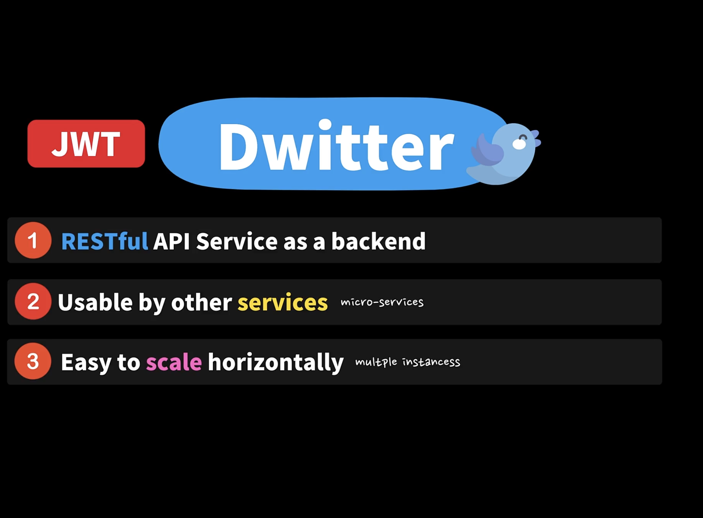

## 16.1 드위터의 Auth 선택은? 이유는?



### Q.

- 구글에 JWT관련 예제를 보면 즉시 로그아웃 문제, 보안문제, 기타 다른 문제들이 있어서 refresh token을 서버에서 redis 같은 곳에 관리하고 access token만 client에게 발급하는 방식이 많이 보이는데요.

- 이렇게 구현하면 세션과 마찬가지로 서버에서 refresh token을 관리하는거니까 stateful한거고 그럼 세션의 문제점이 따라올거같은데 이런 방식으로 JWT를 구현해도 JWT가 가지는 장점이 있나요??

- 그리고 이런 방식이 추천되는 방식이 맞는지 궁금합니다.

### A.

- 좋은 질문이예요 👍

- 우선 첫번째, Refresh Token (지금부터 편의상 RT라고 할게요)은 토큰을 강도당하는 보안 취약점을 전혀 개선해 주지 않아요. RT을 사용할때 클라이언트 측에서 안전한 방식으로 보관하도록 신경을 써줘야 해요. (JWT도 마찬가지!) 보통 RT는 AT(Access Token)보다 수명이 길기 때문에 (RT 특성상 만료 기간이 더 길어요), 한번 해커가 훔쳐가면 더 위험성이 크기 때문에 RT를 더 보안에 신경써줘야 하죠.

- 다만, 세션을 사용하면 서버에서 강제적으로 로그아웃을 시키는 부분을 구현할 수 있는데, JWT는 그렇게 하지 못하죠. RT는 이런 JWT의 단점을 개선할 수 있지만 앞에서도 언급했듯 보안 자체를 크게 개선해 주지는 못해요. (클라이언트 측에서 관리 잘못하면 더 망할..가능성이...ㅎㅎㅎ)

- 두번째로는, 많은 분들이 Redis나 다른 중앙 Auth관리 서비스를 사용하면 서비스를 stateful하게 만든다고 오해 하시는데, 상태(state)를 한 서버에만 로컬적으로 가지고 있는 경우에만 서비스가 stateful 하지, 중앙 관리형 Redis 같은 경우는 하나의 서버 로컬에 정보가 있는것이 아니기 때문에 stateful 하다고 볼 수 없어요.

- 마지막으로, RT를 함께 사용한다고 해도 여전히 JWT를 사용하는데 아래와 같이 큰 장점이 있어요.

- Redis나 다른 Auth 서비스에 통신 하지 않고도 JWT를 통해서 바로 인증할 수 있다. (부가적인 네트워크 요청이 필요 없으므로 성능이 좋다)

- RT만 Redis나 다른 Auth 서비스에 통신 하면 됨

- 즉, 그냥 세션을 사용하게 되면, 모든 API 요청에 대해서 Redis나 다른 서비스에 통신해서 사용자의 요청을 인증해야 하지만, RT + JWT를 사용하면 모든 API 요청은 JWT만 확인하면 되고, RT를 업데이트 또는 발행해야 할때만 다른 인증 서비스를 이용하면 되죠 😆

JWT를 RT없이 보안에 안전하게 만드는 다른 방식은 보너스 챕터 한번 보세요 :)

### Q.

- 저기 치명적인 보안편에서 "xss어택에 안전한 백엔드 업데이트" 강의에서 궁금한게 있는데 거기에는 discussion란이 없어서 여기에 질문드립니다.

- 9분30초쯔음부터 나오는 강의 내용이 좀 이해가 잘 안되는데

1. "브라우저 client는 쿠키에 자동으로 들어온다" 라고 나오는데 이게 json body부분에 쿠키가 들어온다는 건가요?

2. "그외는 쿠키 사용안하므로 헤더에 온다" 라고 나오는데 브라우저에서도 헤더 부분에 Authorization: Bearer .... 이렇게 오지 않나요??

3. "헤더에 토큰이없으면 브라우저 클라이언트" 이 부분도 2번과 마찬가지로 브라우저 client에서 요청이 올때 헤더부분이 있지 않나요??

4. 모바일 클라이언트에게 요청이 올때는 헤더가 없이 json body만 오는건가요?

### A.

- HTTP Only 옵션을 사용해서 쿠키 (쿠키도 헤더에 들어있는 데이터예요)를 서버에서 클라이언트에게 보내게 되면, 브라우저 클라이언트는 자동으로 서버에서 받은 HTTP Only 마크가 되어있는 쿠키의 데이터를 나중에 다른 요청을 할때 자동으로 헤더에 포함해서 요청을 보내요. 하지만 다른 모바일 클라이언트들은 이런 기능이 없답니다 :)

- 쿠키는 헤더에 있어요. Cookie라는 키에 여러가지 쿠키들이 ; 세미클론으로 구분되어서 값으러 지정되어져 있죠

```
Cookie: token=value; cache=value;

```

- 브라우저외 클라이언트들은 Cookie가 아니라 헤더에 있는 Authorization 에서 받아오겠죠?

```
Authorization: value
```

## 16.3 로그인 Rest APIs 디자인 하기 💡

- 저의 노션 페이지 링크: https://www.notion.so/API-Spec-Auth-c5bcb65d75c7415dbd47cc3be818c5a0
