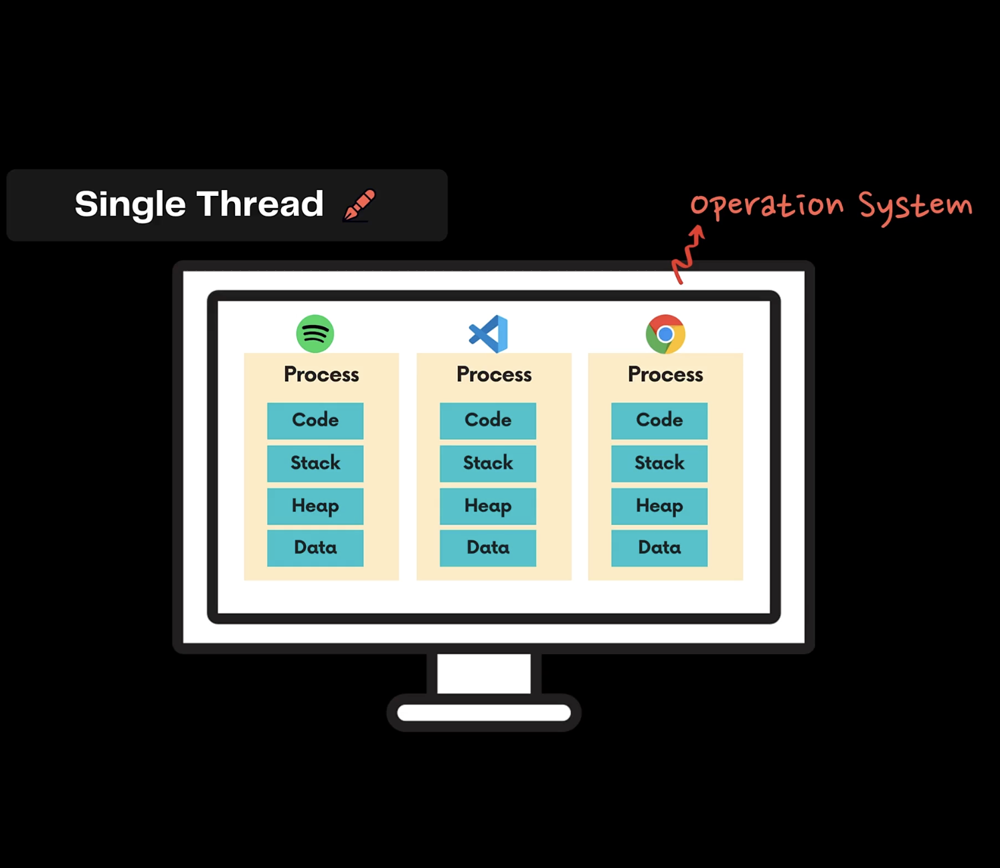
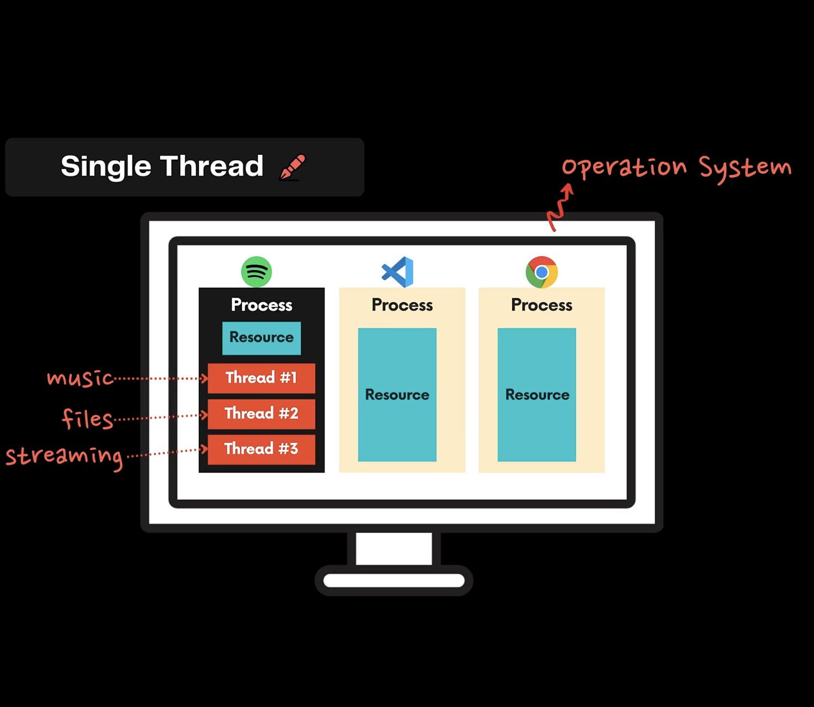
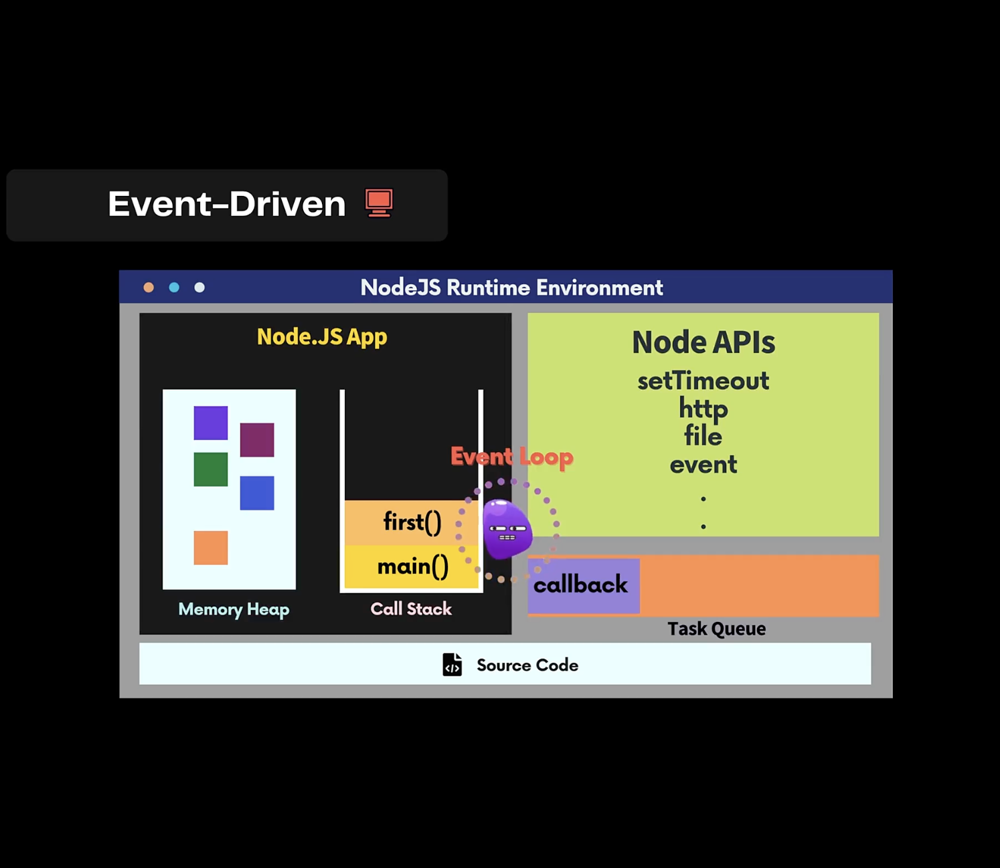
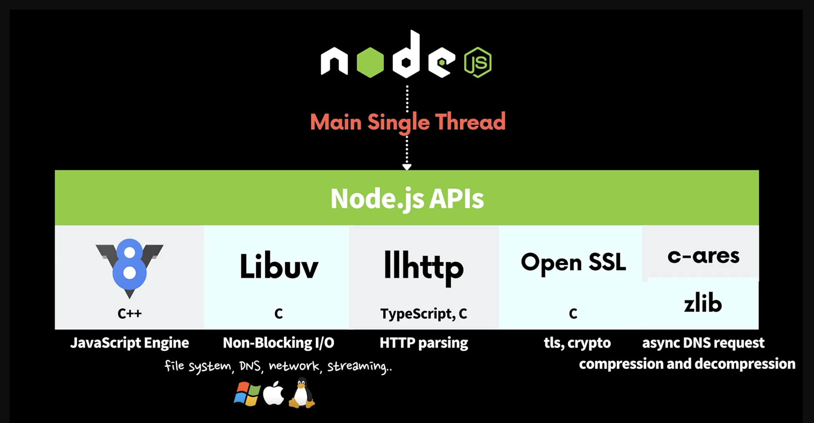
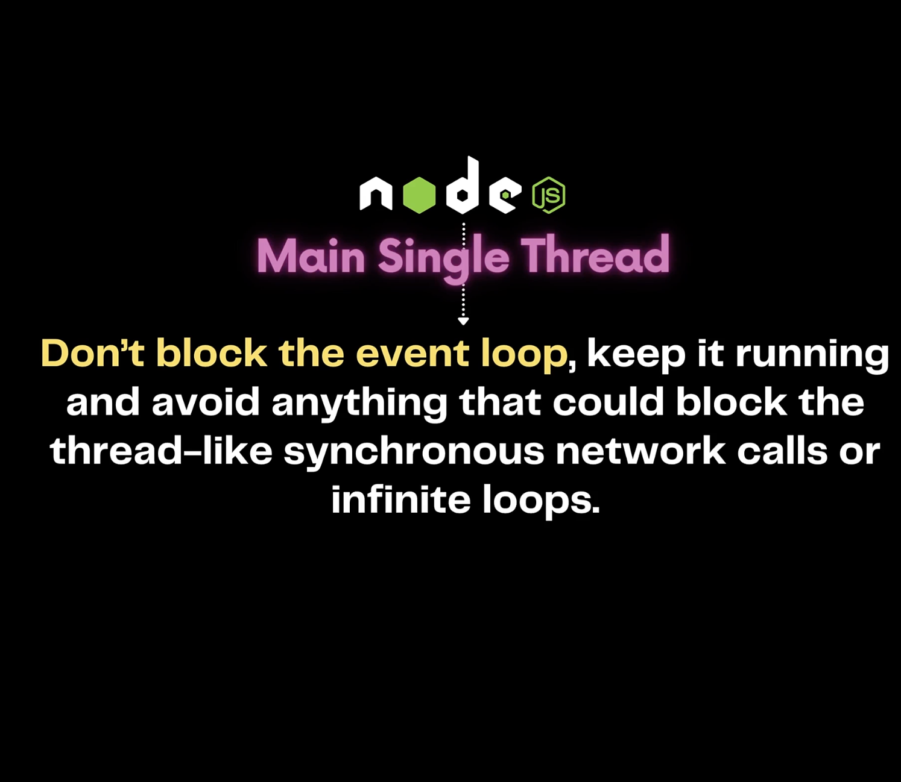
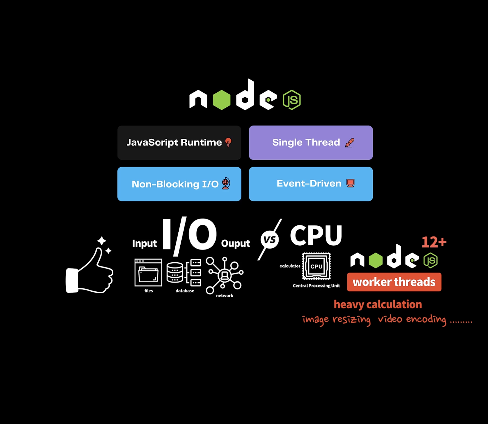
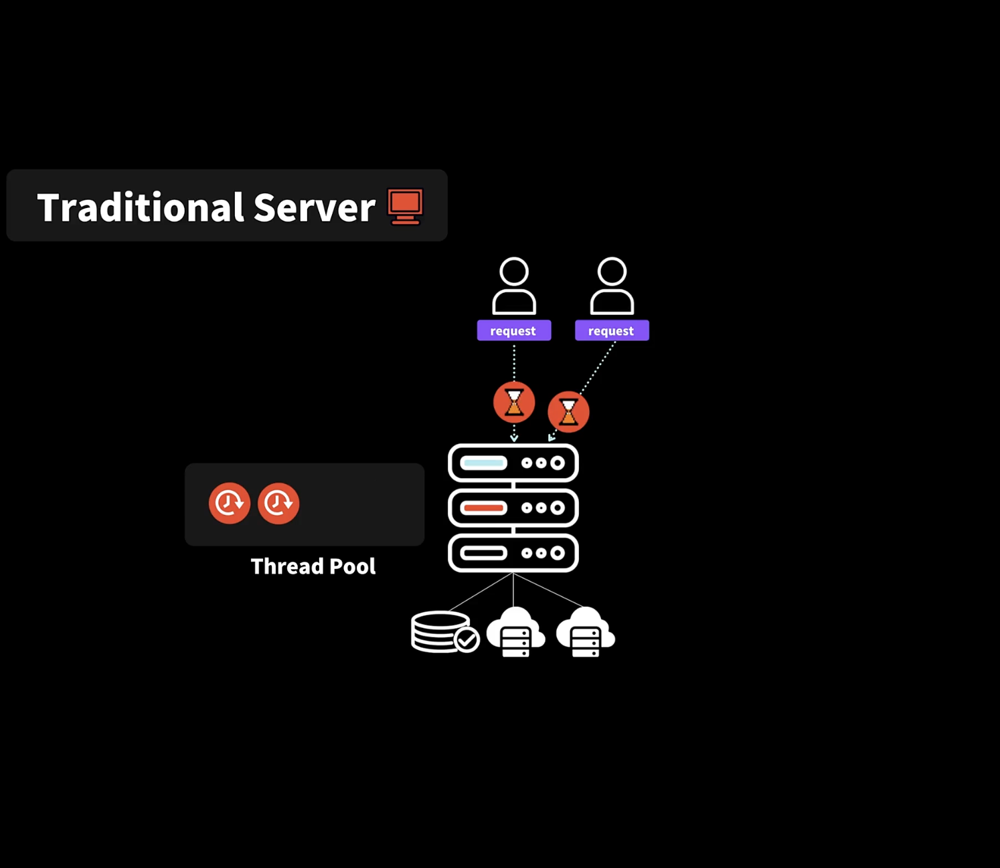
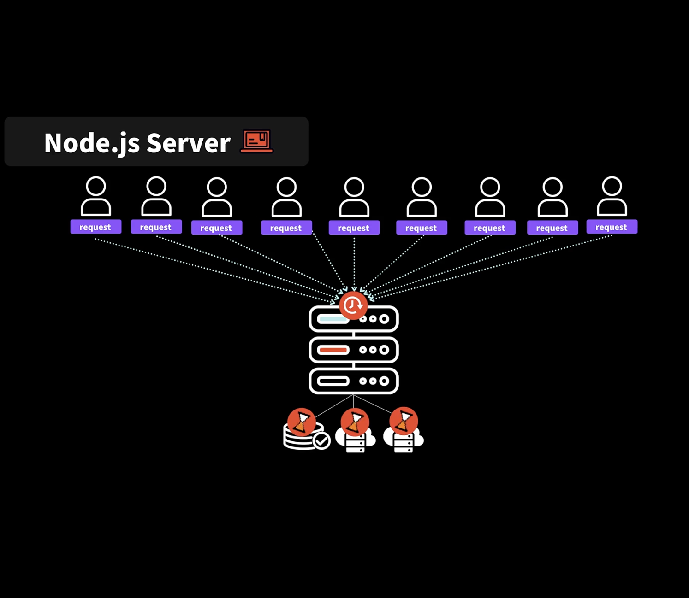

## 2.2 Node.js란 무엇인가? 공부 포인트!

- 브라우저에는 자바스크립트를 실행할 수 있는 자바스크립트 엔진이 있다.

  - 대표적으로 JIT(Just In Time compilation)을 지원하는 크롬의 V8가 있다.

- Node.js is a **JavaScript runtime** built on Chrome's V8 JavaScript engine

- Node.js is an open-source, cross-platform, back-end JavaScript runtime environment that runs on the V8 engine and executes **JavaScript code outside a web browser**

- "JavaScrip everywhere"

- 브라우저 상에서 다양한 WebAPI를 사용할 수 있는 것 처럼, 노드에서는 노드 환경에서 제공하는 다양한 API가 있다.

- 이러한 API에 대해서 공부한 다음, 이러한 API들을 편하게 사용할 수 있게 도와주는 Express, Nest 등에 대해서 공부해보는 게 좋다

 

## 2.3 노드를 배우면 좋은점들

### 1. JavaScript everywhere

- 클라이언틑와 서버를 개발할 때 한 언어로 개발할 수 있다

- Easy entry into backend development

### 2. 50% of the developers use Node.js

- 절반이 넘는 개발자들이 노드를 사용하고 있다

### 3. Big Corporates use Node.js

- 큰 대기업들도 노드를 사용하고 있다.

### 4. Easy, Simple yet Powerful and flexible

- Easy Learning Curve

- Great Productivity

- Good Performance

### 5. Strong Community

- Node Package Manager

 

## 2.4 노드의 4가지 매력포인트

### JavaScript Runtime

- ECMAScript 표준과 Web Assembly를 구현한 V8이라는 크롬브라우저에서 사용하고 있는 자바스크립트 엔진은 C++로 작성되어 있고 오픈소스 프로젝트로 성능이 좋다

- 노드는 이러한 V8 엔진을 기반으로 한다

### Single Thread

- OS에서 여러가지 프로그램을 실행하면 프로그램마다 프로세스가 할당된다

- 프로세스가 프로그램이라고 봐도 무방

- 프로세스가 병렬적으로 실행되는 것 처럼 보이지만 사실은 컴퓨터가 굉장히 빠른 속도로 이 프로세스, 저 프로세스 각각 시간을 할당하면서 마치 병령적으로 처리되는 듯한 효과를 준다

- 물론 어떤 CPU를 사용하느냐에 따라 정말 병렬적으로도 실행될 수 있다

- 각각의 프로세스 안에 프로그램에 대한 Code와, 프로그램 안에서 어떤 함수가 실행되는지 함수의 실행 순서를 기억하는 Stack, 그리고 동적으로 생기는 데이터를 보관하는 Heap, 그리고 전역 변수와 같은 다양한 데이터를 보관하는 Data 총 4가지로 나누어져 있다.

- 프로세스가 실행되다가 문제가 생기면 프로그램이 동작하지 않거나 반응이 없게 된다.

- 프로세스 안에 필요한 모든 자원을 Resource라고 하자,

- 프로세스 안에서 파일을 요청하고 받아와서 음악을 재생한다면

- 프로세스가 절차적으로만 실행한다면 각 단계를 끝마쳐야지 다른 작업으로 넘어가게 되고

- 이 때 사용자는 다른 프로그램을 클릭해도 아무런 동작을 할 수 없게 된다

- 하지만 프로세스 안에는 여러가지 스레드가 있다.

- 음악을 재생하는 스레드, 파일을 읽는 스레드, 스트리밍을 하는 스레드등

- 원하는 기능 마다 개별적인 스레드를 만들 수 있고, 동시에 실행되는 것 보이지만 스레드들을 순차적으로 시간을 할당해서 실행하면서 동시에 실행되는 것 처럼 처럼 보이게 하는 것

 

- 스레드가 많으면 많을 수록 좋을 것 같지만 그렇지 않다

- 스레드가 동작하기 위해서 필요한 정보들을 개별적으로 만들어야 하기 때문에 메모리 사용량이 증가할 수 있고

- 스레드 개수 많아지면 순차적으로 기회들을 주어야 하기 때문에 이 부분에서도 비용 발생

- 여러가지 스레드가 프로세스 안에 있는 공통된 리소스에 접근하면 어떤 애가 업데이트 하는 동안 다른애가 쓸 수 없고 이러한 문제생길 수 있다.

- 스레드가 많다고 무조건 좋은 것 아니다

- 한 프로그램 내에서 여러가지 스레드를 사용하는 것을 멀티 스레딩이라고 한다

- 자바같은 언어는 언어 자체적으로 멀티 스레딩 할 수 있도록 Cuncurrency API를 지원한다

- 개발자가 필요하다면 여러가지 스레드를 만들 수 있다.

- 결코 쉬운 일 아니기 때문에 Cuncurrency API에 대해 이해하고 잘 사용해야 한다

- 자바스크립트는 싱글 스레드 언어, 하나의 작업을 수행하면 다 끝나야지 다른 작업을 수행할 수 있다

- 동기적인 프로그래밍 언어

- Non-Blocking I/O, Event-Driven 와 같은 런타임 특징 때문에 여러가지 일을 동시 다발적으로, 효율적으로 할 수 있는 것

### Non-Blocking I/O

- I/O는 Input과 Output

- 컴퓨터에서 파일을 읽고 쓰거나, 데이터베이스에서 읽고 쓰는 것, 네트워크 요청을 하고 응답을 받는 것과 같이 하드웨어적인, 물리적인 것에 대한 읽고 쓰는 것을 I/O라고 한다

- 상반대는 개념은 CPU (Central Processing Unit)

  - CPU는 우리가 갖고 있는 두뇌

  - 직접 계산하고 연산

  - I/O는 외부적으로 읽고 쓰는 것을 말한다

- Blocking는 동기적인 것을 말한다

- Non-Blocking 비동기적인 것을 말한다

- 하나를 수행할 때 콜백을 던져주면, 다 완료되면 콜백을 실행하고 그 동안 나는 다른 작업을 할 수 있는 것

- Non-Blocking I/O는 하나를 수행할 때 할때 기다리지 않고 콜백을 전달해주고 다 완료되면 콜백을 실행하도록 하고 다음으로 넘어가는 것

### Event-Driven

- Non-Blocking I/O와 밀접한 관련이 있다

- 콜백을 던져주고 나서 파일을 다 읽는 이벤트가 발생하면

- 이벤트를 통해서 내가 등록한 콜백을 실행할 수 있도록 한다

 

## 2.5 노드 내부속으로 쏘옥 들여다보기

- 노드 js 런타임 환경에 우리가 작성한 소스코드를 동작하게 하면

- 실제로는 노드 어플리케이션 형태로 동작하게 된다

- 자바스크립트로 만들어진 어플리케이션은 싱글스레드 이지만

- 노드 API는 멀티스레딩이 가능하기 때문에

- 원하는 동작이 다 완료되는 이벤트가 발생하면 콜백함수를 태스크 큐에 옮겨주고

- 이벤트 루프가 태스크 큐에 있는 콜백을 콜스택이 비어있을 때 가져와서 실행하게 된다

 

- 노드는 메인 싱글 스레드가 있다

  - 우리 어플리케이션을 실행하는

- 파일을 읽고 쓰는 것과 같은 동작은 노드가 제공하는 API를 통해 할 수 있고

- 이벤트가 발생했을 때 실행되어야 하는 함수를 콜백함수를 전달하면

- 노드 내부적으로 병렬적으로 이를 처리한다

- 노드 내부를 살펴보면 아래와 같이 V8이라는 자바스크립트 엔진도 있고

- Libuv라는 C로 작성된 라이브러리가 비동기적으로 할 수 있도록 지원하는 라이브러리

  - 각기 다른 운영체제에 맞게 처리를 해준다

- llhttp

  - http 파싱

- c-ares

  - DNS를 요청하는 모듈

- 이 외에도 노드를 동작하기 위한 모듈들을 자체적으로 가지고 있다.

- 우리 어플리케이션은 메인 싱글 스레드에서 작동한다는 것이고

- 그 말은 우리가 등록한 콜백함수는 결국 우리 어플리케이션에서 동작하기 때문에

- 즉, 싱글 스레드에서 동작하기 때문에 콜백함수에서 무엇인가 무거운 일을 실행하게 되면

- 결국 일이 다 끝나기 전까지 다음 콜스택으로 넘어가지 않기에

- 콜백으로 전달하는 함수는 가벼운 일들만 처리해야 한다

 

- 노드는 I/O 관련된 일에는 최고다

- Non-Blocking I/O 와 Event-Driven 방식으로 되어 있기 때문

- 오히려 멀티 스레딩 환경보다 효율적으로 I/O처리를 담당할 수 있다

- 하지만 CPU에는 노드가 적합하지 않다

- 노드 자체적으로는 싱글 스레드로 동작하기 때문에 무거운 일에는 적합하지 않다

- 하지만 노드 12 이상 부터는 worker threads라는 스레드를 만들 수 있는 api를 활용할 수 있다

- 무거운 계산을 해야하는 경우 worker threads를 활용할 수 있다

- 하지만 멀티스레딩은 조심해야 사용해야 한다

- 스레드를 많이 만들게 되면 그 자체만으로도 메모리를 많이 잡아먹게되고 성능에도 안 좋은 영향을 끼치게 된다

 

## 2.6 노드 서버의 특징과 장/단점

- 전통적인, 지금도 많이 쓰이는 전형적인 서버가 동작하는 방법

- 서버는 한 서버내에 데이터베이스를 갖고 있는 경우도 있고

- 클라우드나 다른 서버에 데이터 베이스를 갖고 있는 경우도 있고

- 여러개의 서버를 두고 데이터를 공유하는 방법도 있다

- 서버는 멀티 스레딩 환경이기 때문에 스레드 풀이 있다

- 한 서버에 만들 수 있는 스레드의 수는 제한적이기 때문에

- 만들 수 있는 가능한 수의 스레드를 보관하는 스레드 풀이 있다

- 클라이언트 요청이 오면 하나의 스레드를 할당하고

- 또 다른 요청이 들어오면 스레드를 할당하게 된다

- 한번에 처리할 수 있는 스레드 개수 이상의 요청이 들어오게 되면

- 처리할 수 있는 스레드가 생길 때 까지 기다렸다가

- 스레드 풀에 대기하고 있는 스레드가 생기면 그 때 처리할 수 있게 된다

 

- 노드 서버는 이와 달리 하나의 메인 스레드가 있다

- 요청이 들어오게 되면

- 데이터 베이스 관련 요청이면 데이터베이스에게

- 네트워크 관련 요청이면 네트워크에게 던진다

- 즉, 하나의 스레드가 요청을 받고 그 뒤에 있는 아이들에게 던지고

- 그 아이들이 작업이 끝나면 해당하는 요청에 대해 응답을 해준다
