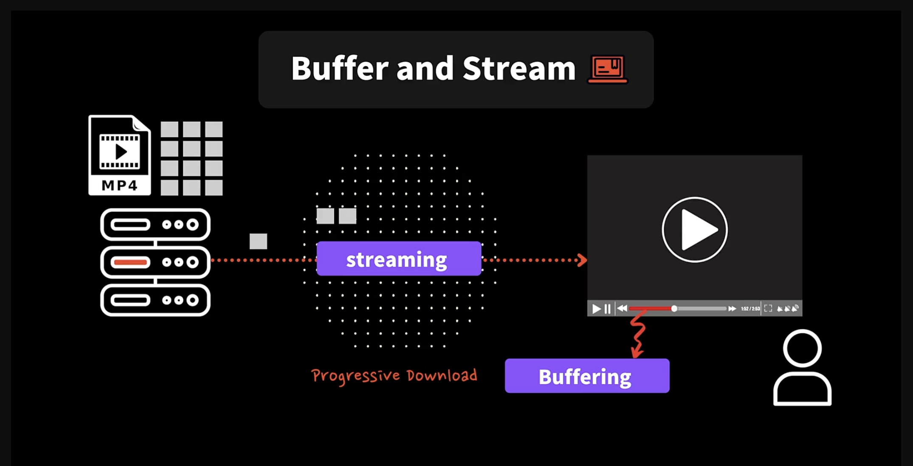

## 4.2 노드 관련 필수사이트 북마크 하기 🔖

- 북마크

  - 노드 입문자를 위한 심플한 사이트: https://nodejs.dev/en/learn/

  - 노드 공식 사이트: https://nodejs.org/en/docs/

---

## 4.3 글로벌 오브젝트 - 소스 공부법

- Globals

  - https://nodejs.org/docs/latest/api/globals.html

- 윈도우나 VSCode 최신 버전에서 Node 타입 정의 파일이 업데이트 되었어요 :)

- 저와 다르게 아래와 같이 global 정의가 나와도 놀라지 마세요.

  ```js
  declare var global: typeof globalThis;
  ```

  - [globals.global.d.ts](https://github.com/DefinitelyTyped/DefinitelyTyped/blob/9d59b7aadafb5ee2afac9c4440b82e692a7449c1/types/node/globals.global.d.ts)

- 저는 @types/node_version 15로 사용하고 있고, 위와 같이 나오신다면 아마 여러분들은 버전 16 이상을

- 사용하고 계실거예요.

- 타입 정의 여기서 확인해 보세요: https://github.com/DefinitelyTyped/DefinitelyTyped/blob/9d59b7aadafb5ee2afac9c4440b82e692a7449c1/types/node/globals.d.ts#L97

<br/>

### Q. global vs globalThis의 차이

- 에디터에서 global을 치면 추천으로 globalThis가 나와 찾아봤는데요,

- 전역 객체에 접근할 때 웹에서는 window,

- Web Workers에서는 self,

- Node에서는 global

- 각기 다른 이름으로 접근해야 했던 것을 하나의 이름으로 통일하고자 만든 새로운 표준이 globalThis라고 합니다.

- 그래서 globalThis를 사용하면 Node에서 global을 쓴 것과 동일하고 브라우저에서 window를 쓴 것과 동일하다고 하네요!

- 이 링크에 자세한 설명이 있습니다

  - https://blog.logrocket.com/what-is-globalthis-why-use-it/

### A.

---

## 4.6 모듈 (export, require)

아래처럼 처음 선언할 때는 module을 생략해서 할당할 수 있다.

```js
module.exports.getCount = getCount;

exports.increase = increase;

console.log(module);
console.log(module.exports === exports); //  true
```

- exports는 module.exports를 참조하는, 참조값을 가지고 있다

- 이를 통해서 등록할 수 있는 것

- 하지만 아래처럼 exports에 다른 값을 할당하면

- module.exports에 값이 등록되지 않는 것을 확인할 수 있다

```js
module.exports.getCount = getCount;

exports = {};

exports.increase = increase; // 빈 객체에 등록

console.log(module);
console.log(module.exports === exports); //  false
```

- 그렇기 때문에 module 키워드를 생략하고 exports에 바로 값을 등록하는 것은 위험하다

---

## 4.7 2015 최신 모듈 (export, import)

- common.js가 아니라 자바스크립트에서 자체적으로 지원하는 module을 사용할 것이라고 선언

```json
  "type": "module",
```

---

## 4.9 process (프로세스) 정보

### Q.

- nextTick이 단순히 nextTick의 콜백 함수를 태스크 큐에 넣는데 그치는게 아니라, 태스크 큐에서 대기 중인 콜백들 중에서 가장 선처리 될 수 있도록 강제하는 것이라는 거죠?

### A.

- 그렇죠 👍👍 정확해요!

- 현재 블럭 안에 있는 코드가 다 실행되고 나서 비동기적으로 나중에 실행되길 원할때 (즉, 태스크 큐에 넣고 다음줄로 바로 넘어가길 원할때) 쓸 수 있는 방법이 setTimeout과 nextTink이 있어요.

- 차이점은 setTimeout(() => { }, 0) 이건 태스크 큐 제일 끝으로 넣어주는 반면

- nextTick은 큐 제일 앞으로 넣어줘서, 가능한 제일 빨리 실행될 수 있도록 해주죠

---

## 4.10 타이머와 콜스택의 연관

- 아래와 같은 코드 실행하게 되면

```js
console.log("code1");
setTimeout(() => {
  console.log("setTimeout 0");
}, 0);

console.log("code2");
setImmediate(() => {
  console.log("setImmediate");
});

console.log("code3");
process.nextTick(() => {
  console.log("process.nextTick");
});
```

- 다음과 같은 순서로 출력된다

```shell

code1
code2
code3

process.nextTick # 태스크 큐의 우선순위 제일 높으므로
setTimeout 0
setImmediate

```

- setTimeout과 setImmediate는 거의 동일

<br/>

- 아래 코드는 코드를 실행하는데 얼마나 걸리지 알아보기 위한 코드

```js
console.log("code1");
console.time("timeout 0");

setTimeout(() => {
  console.log("setTimeout 0");
  console.timeEnd("timeout 0");
}, 0);

/**
 * code1
 * setTimeout 0
 * timeout 0: 3.015ms
 * /

```

- 즉, 정확히 0초가 보장되지 않는다. 콜스택이 텅텅비어있을 때 까지 기다려야 하기 때문

---

## 4.12 file 동기와 비동기 그리고 프로미스

### Q.

- 강의 중 1, rename(...,callback) 형태랑 2, promises.rename().then.catch() 형태는 비동기적이기 때문에 같이 실행시키면 뭐가 먼저 일어날지 모른다고 하셨는데,

- 코드 상 1->2번 순이면 nextThick 이나 타이머 함수가 안쓰이는 즉, 별다른 이유 없으면 테스크 큐에 순서대로 쌓이는거 아닌가용? 아니면 그냥 내부적 사정으로 순서를 보장할 수 없는건가요??

- node api 가 멀티스레드 여서 순서를 보장 못한다고 이해하면 맞는걸까요..??

### A.

- 그쵸! rename 함수 자체가 비동기 적이기 때문에 어떤것이 먼저 끝날지는 보장 할 수 없어요 :)

<br/>

### Q. 태스크큐 질문드립니다

- 앞선 질문과 동일하게 콜백함수를 이용하는 rename과 promise를 이용하는 rename을 차례대로 실행하면 어느것이 먼저 실행되는지 알 수 없다고 하신거에 대한 질문입니다!

- 제가 자료구조를 배웠을 때 Queue는 FIFO구조이기 때문에 먼저 들어온것이 제일 먼저 나오는걸로 알고있습니다.

- 그럼 한줄씩 읽으며 내려갈 때 콜백함수를 이용하는 rename이 먼저 TaskQueue안에 들어가게되고 promise를 이용한 rename이 두번째 들어가면서 콜백함수를 이용한 rename이 먼저 실행되는 것이 아닌가요?

- 아니면 콜백함수rename이 Queue안에서 실행은 먼저되는 것이 맞지만 끝나는 시간이 두번째 실행된 promise rename이 먼저 끝날 수 있어서 그런걸까요?

- 또 번외질문이지만 TaskQueue안에 함수가 담길 때 실행된 결과값을 가지고 있다가 동기처리가 끝나면 내뱉는건가요? 아니면 실행 전 함수 그 자체를 담고있다가 내뱉으면서 실행을 하는건가요!

### A.

- 엄밀히 말하면 콜백함수는 태스크 큐에

- 프로미스 함수는 마이크로 태스크 큐에

- 각각 다른 큐에 들어 가게 됩니다 :)

---

## 4.14 버퍼와 스트림 👫 베스트 프렌드



- 서버가 사용자에게 동영상 파일일을 보내고 동영상 다 다운로드 받을 때 까지 기다린 다음에야 동영상을 볼 수 있다면 너무 오래 걸린다는 문제가 있다

- 서버에서 잘게잘게 나누어서 조금씩 보내주는 것

- 이것을 스트림이라고 한다

- 이를 통해 동영상을 모두 받지 않아도 동영상 볼 수 있다

- 이것을 Progressive Download 라고 한다

- 그리고 사용자가 동영상을 보는 속도보다 다운로드 받는 속도가 더 빠르다면 버퍼링을 이용해서 조금씩 버퍼를 채울 수 있다

- 반대로 다운로드 받는 속도보다 사용자가 보는 속도가 빠르면 충분히 쌓여 있는 버퍼가 없기 때문에 흔히들 말하는 버퍼링에 걸리게 된다

- 이렇게 사용하는게 버퍼와 스트림

<br/>

- 컴퓨터에서도 정말 큰 사이즈의 파일을 한번에 다 읽는다면 그 파일의 데이터를 메모리에 다 가지고 온다

- 만약 메모리보다 더 크다면 당연히 안된다

- 이럴때는 조금씩 버퍼를 스트리밍해서 메모리로 가지고 오면 된다

- 버퍼와 스트림은 메모리가 효율적이고 시간도 효율적이다

---

## 4.15 버퍼, 제대로 알아보기

### Q. 버퍼 배열 아스키코드 값

- 버퍼를 배열형태로 접근하면 아스키코드값이 나온다고 하셨는데

```js
const buf = Buffer.from("ㅇ");

console.log(buf[0]);
```

- 이렇게 Buffer.from함수 안에 한국어를 넣었을 때

- console.log로 출력했을 때 227이라는 값이 나오는데 이것도 아스키코드 값인지 궁금합니다..!

### A.

- 영어 알파벳을 예제로 들어서 제가 아스키코드 값이라고 했지만,

- 엄밀히 말하면 Bufferd에서 별도로 인코딩을 지정하지 않으면 UTF-8 인코딩 방식을 써요. 즉 아래 코드와 동일하게 버퍼를 만든다고 보시면 되요:

```js
const buf = Buffer.from('hi'');
const buf = Buffer.from('hi', 'utf8');    // 위 코드와 동일
```

- UTF-8 인코딩은 아스키코드와 완벽하게 호환되니깐 기존에 아스키코드에서 가지고 있는 모든 값을 포함해서 추가적으로 다른 언어의 테이블도 가지고 있다고 보시면 되요 :)

---

## 4.16 스트림의 매력

- ReadStream의 정의를 보면 아래처럼 Buffer 가 올 수도 있고 utf-8로 옵션을 지정하면 string으로 전달받을 수도 있다.

```ts
 on(event: "data", listener: (chunk: Buffer | string) => void): this;

```

- 아래처럼 데이터를 읽고 에러처리를 할 수 있다.

```ts
const readStream = fs.createReadStream("./file.txt", {
  highWaterMark: 8, // 기본값: 64 kbytes, 한번에 얼마만큼 데이터를 읽어올지
  encoding: "utf-8",
});

readStream.on("data", (chunk) => {
  console.log(chunk);
  // 데이터가 부분부분씩 출력이 된다
});

readStream.on("data", (error) => {
  console.log(error);
});
```

- on은 자기자신을 리턴하므로 아래처럼 체이닝을 할 수 있다.

```ts
fs.createReadStream("./file.txt", {
  highWaterMark: 8, // 기본값: 64 kbytes, 한번에 얼마만큼 데이터를 읽어올지
  encoding: "utf-8",
})
  .on("data", (chunk) => {
    console.log(chunk);
    // 데이터가 부분부분씩 출력이 된다
  })
  .on("end", () => {
    console.log(data.join(""));
  });
```

---

## 4.17 파이프 ǂ

- fs.createReadStream(..) 호출하면 읽을 수 있는 스트림 자체는 생성하지만,

- 바로 자동으로 데이터를 내부 버퍼나 메모리에 읽어 오지는 않아요.

- pipe를 연결할때 읽어 오지요 🤓

- ReadStream에는 paused 모드와 flow 모드 두가지가 있는데. 생성만 하면 paused 모드로, 멈춰 있는 상태고 on('data', ..) 나 pipe과 같이 읽을 수 있는 flow 모드를 사용해야 읽어 와요.

- 자세한 내용을 공부 하고 싶다면 여기를 읽어 보세요:https://nodejs.org/api/stream.html#stream_two_reading_modes

---
