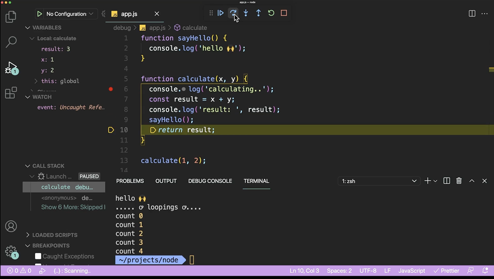
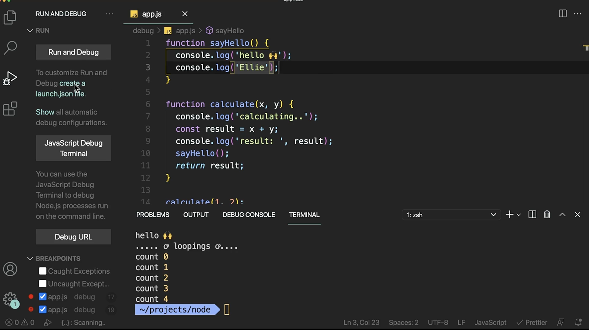

## 6.1 디버깅의 궁극적인 목표

- 디버깅에서 가장 중요한 것은 문제를 정의하는 것

- 어떤 문제인지, 어떤 버그인지 정의해야지 솔루션을 찾을 수 있다.

---

## 6.2 디버거 기본 사용법 (툴 제대로 쓰기)



- Breakpoint를 설정하면 해당 부분에서 실행이 멈추게 된다

- vscode 기준 왼쪽바의 Run and Debug로 실행하도록 한다

- step over

  - 코드 한줄한줄씩 진행한다

  - 코드에서 다른 함수를 호출하는 경우에는 해당 함수 안으로는 들어가지 않는다

- step into

  - 함수 안까지 들어간다

- WATCH 에는 관심있는 로직이나 변수를 추가해서 흐름을 파악할 수 있다.

---

## 6.3 디버거 꿀팁 🍯

- 디버거를 사용하면 실시간으로 값을 변경하면서 확인할 수 있다

- 예를들어 VARIABLES에 있는 값을 변경하면 변경된 값이 바로 반영이 된다

- WATCH에서도 i === j 라는 로직을 추가하게 되면, i값이 변경되었을 때 해당 로직에 대한 결과도 바로 확인할 수 있다.

- Break Point에서 오른쪽 버튼을 클릭하면 보이는 Edit Breakpoint를 사용해서 내가 원하는 조건일 때만 Breakpoint가 동작하도록 할 수 있다.

---

## 6.4 자동 재시작 설정

- 현재는 코드를 수정하게 되면 디버거를 멈춘다음에 다시 시작해야 하는 불편합이 있다

- nodemon 설치해주고,

- create a launch.json file 버튼을 클릭해서 launch.json 파일을 생성한 다음 아래 옵션을 추가해주면



```json
{
  "runtimeExecutable": "nodemon",
  "restart": true
}
```

- 코드를 수정하고 나서 디버거를 멈추지 않아도 다시 디버거가 실행이 된다

<br/>

- nodemon에서 에러가 발생하신다면 nodemon을 글로벌로 설치해 주세요 :)

```shell

npm i -g nodemon

```

- 또는 아래 토론창글을 이용해서 RuntimeExecutable에 nodemon 경로를 지정해 주세요:

  - https://academy.dream-coding.com/courses/player/node/lessons/645/discussions/4824

  - -> runtimeExecutable에 "${workspaceRoot}/debug/node_modules/.bin/nodemon" 를 입력하여 직접 모듈안에있는 nodemon을 가리키게 하니까 global 설치가 아니어도 작동했습니다.

- 그리고 npm에서 패키지를 설치하실때 왠만하면 sudo(파워 권한)로 설치 하시지 않는게 좋아요. 보안에 안전하지 않아서 최대한 피해야 한답니다 😱

- npm에서 무언가 설치하실때 권한 이슈가 나오면 아래와 같이 해보세요:

```shell

sudo chown -R $(whoami) $(npm config get prefix)/{lib/node_modules,bin,share}

```

- https://stackoverflow.com/questions/47252451/permission-denied-when-installing-npm-modules-in-osx/47252840
