## 8.2 HTTP 역사와 HTTPs, 그리고 V2, V3

### HTTP: Hypertext Transfer Protocol

- 하이퍼텍스트는 아주 에전에 링크만 들어있는 문서를 주고 받을 때 사용했던 것

- 요즘에는 JSON, mp3, mp4, html등 다양한 파일을 전송할 수 있으므로 Hypermedia라고 하는게 더 적절

- HTTP는 request와 response로 이루어진 프로토콜

  - 클라이언트가 요청하면 요청에 대한 응답을 해준다

### HTTPS: Hypertext Transfer Protocol Secure

- HTTP에 보안이 추가된 프로토콜

- HTTPS는 TSL이나 SSL 같은 암호화된 방식으로 주고 받기 때문에 제 3자가 그 내용을 볼 수 없다

<br/>

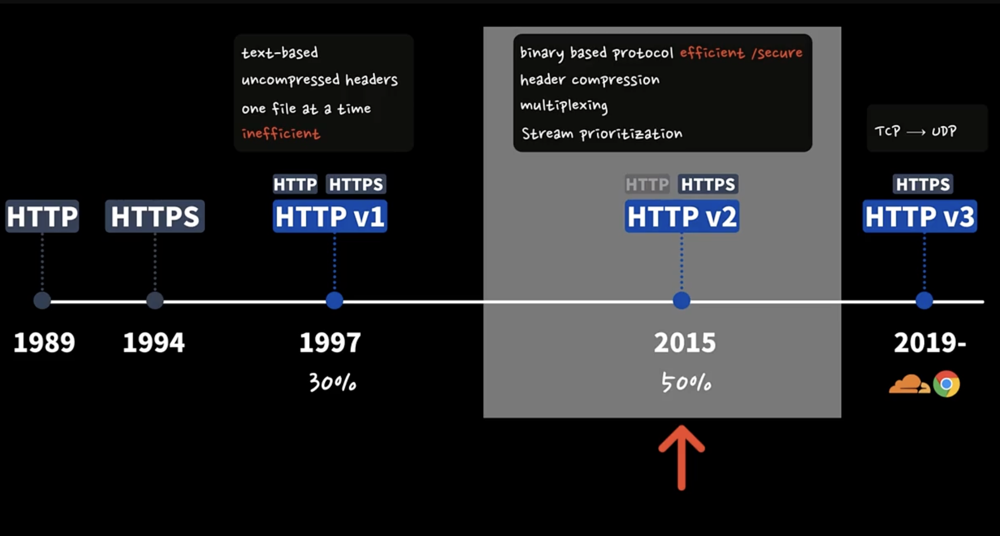

- HTTP v1은 텍스트를 기반으로 한다

- 헤더 부분도 압축하지 않은 버전이므로 사이즈가 크고 한번에 하나의 파일만 주고 받을 수 있다

- v2는 텍스트가 아닌 바이너리 형태로 주고 받고 제 3자가 한눈에 파악할 수 없고 헤더 부분도 압축해서 주고 받는다

- 그리고 멀티 플렉싱, 즉 여러개의 파일을 주고 받을 수 있다.

- 크게 보안과 성능이 개선되었다

  - v2는 HTTPS만 사용할 수 있다.

- v3는 기존의 tcp기반으로 http가 만들어진 것과 달리 udp 기반

---

## 8.3 Status Code 잘 활용하기

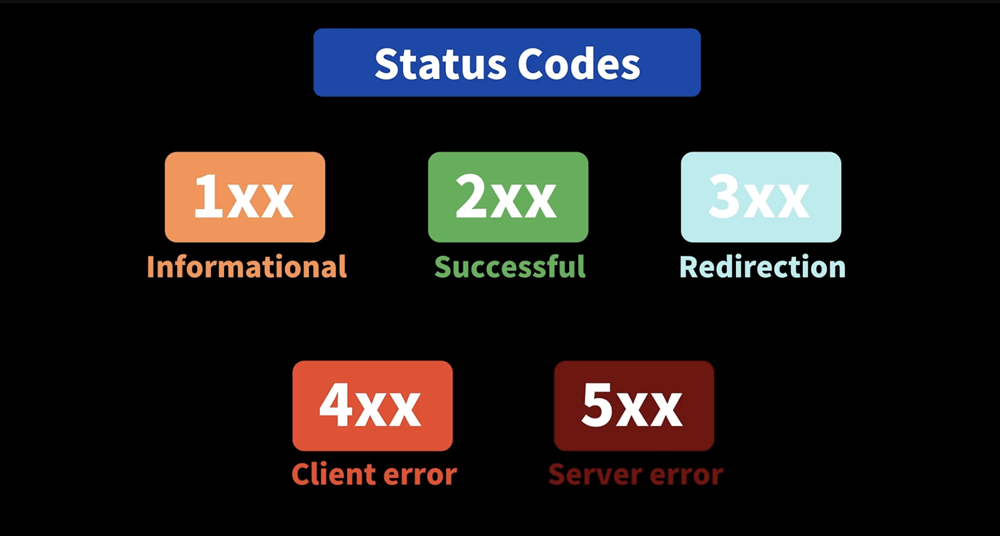

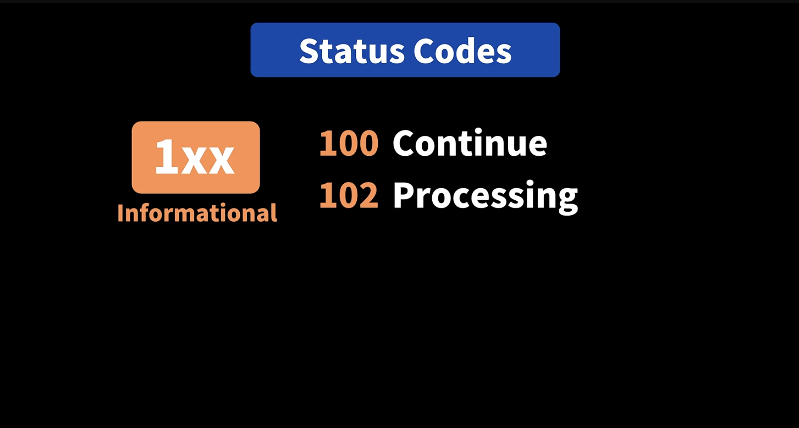

- 100은 클라이언트에게 계속 요청하라는 뜻

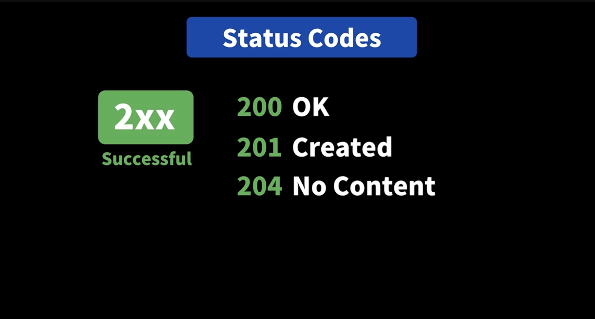

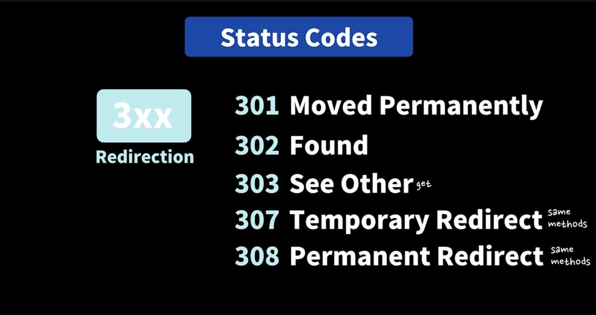

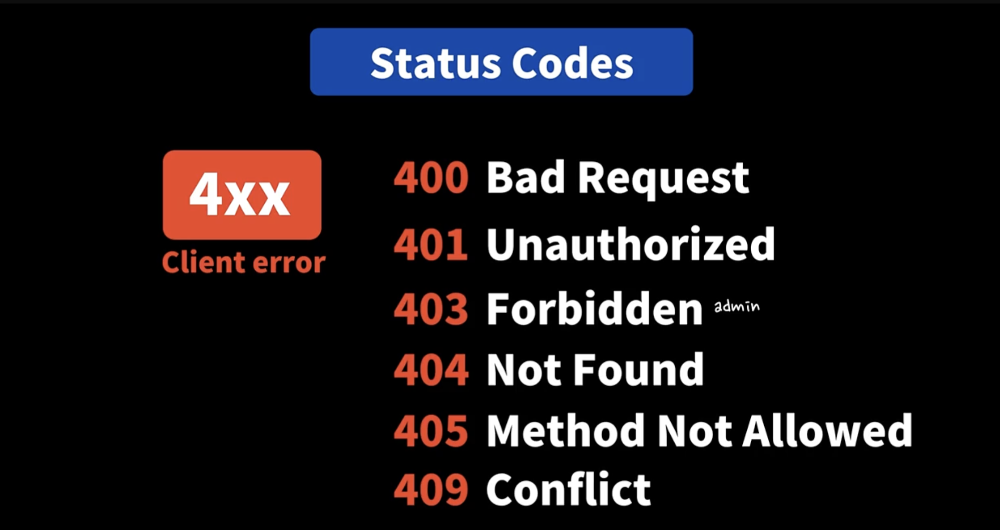

- 보통 로그인하지 않은 사용자가 요청할 때 401

- 403은 로그인한 사용자이긴 하지만 권한이 없을 때

- 405는 해당 url에 한해서 쓰거나 삭제하는 요청이 허용되지 않을 때

- 409는 사용자가 만들고자 하는 리소스가 이미 있거나 충돌이 발생할 때

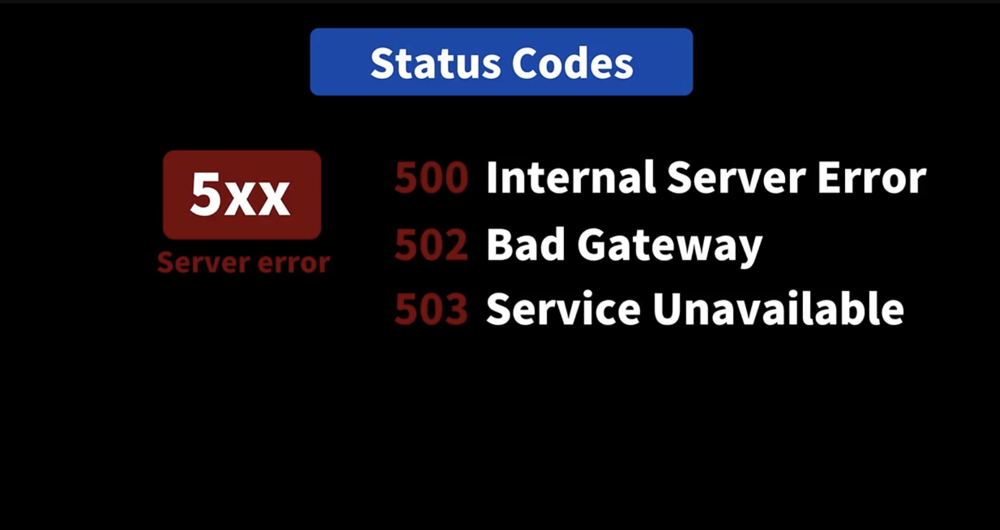

- 502는 중간에 있는 서버가 어떤 요청을 받아 응답을 처리해야 하는데 어떻게 처리해야할지 모를 때

- 503은 서버가 아직 요청을 처리할 준비가 되지 않았을 때

- Reference

  - https://developer.mozilla.org/en-US/docs/Web/HTTP/Status

  - https://developer.mozilla.org/ko/docs/Web/HTTP/Status (한국어 버전)

---

## 8.4 Request Method + 면접 질문!

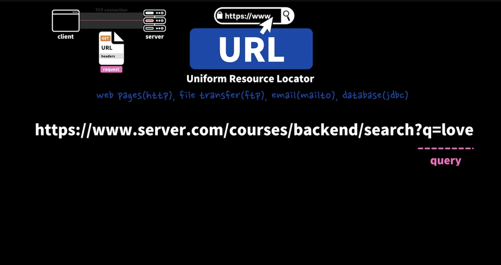

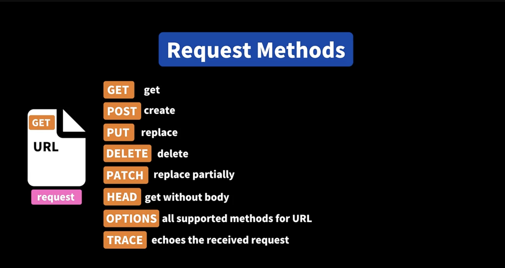

### [GET](https://developer.mozilla.org/en-US/docs/Web/HTTP/Methods/GET)

|                              |     |
| ---------------------------- | --- |
| Request has body             | No  |
| Successful response has body | Yes |
| Safe                         | Yes |
| Idempotent                   | Yes |
| Cacheable                    | Yes |
| Allowed in HTML forms        | Yes |

- safe는 여러번 요청해도 서버에 데이터를 읽어오기 때문에 서버를 변경하지 않기 때문에 안전하다는 것

  - [Safe](https://developer.mozilla.org/en-US/docs/Glossary/Safe/HTTP)

- Idempotent 는 동일한 요청을 몇번 했는지 상관없이 항상 서버를 동일한 상태로 유지할 수 있냐를 나타낸다

  - [Idempotent](https://developer.mozilla.org/en-US/docs/Glossary/Idempotent)

- Cacheable

  - 서버에서 캐시를 할 수 있다.

### [POST](https://developer.mozilla.org/en-US/docs/Web/HTTP/Methods/POST)

### [PUT](https://developer.mozilla.org/en-US/docs/Web/HTTP/Methods/PUT)

### [PATCH](https://developer.mozilla.org/en-US/docs/Web/HTTP/Methods/PATCH)

<br/>

- Reference

  - https://developer.mozilla.org/en-US/docs/Web/HTTP/Methods

  - https://developer.mozilla.org/ko/docs/Web/HTTP/Methods (한국어 버전)
    
  - https://developer.mozilla.org/ko/docs/Glossary/Idempotent (멱등성)

### Q. Idempotent about PUT/PATCH

- 같은 업데이트 (하나는 부분적 이라고 해도)인데도 왜 하나는 Idempotent 이고 다른 하나는 아닌지 강의내용만 듣고는 이해하지 못했는데, 예시가 될 만한 내용이 있을까요..?

### A.

- PUT은 리소스 전체를 업데이트 하기 때문에 idempotent으로 볼 수 있어요.

- 동일한 PUT 요청을 서버에 여러번 하게 되면, 결국 동일한 리소스로 계속 대체 되니깐 서버에서 업데이트 되는 내용도 동일한 리소스가 되겠죠?

- 반면에 PATCH는 서버에게 데이터를 어떻게 업데이트 해야 하는지를 알려 줘요.

  - https://developer.mozilla.org/en-US/docs/Web/HTTP/Methods/PATCH

  > A PATCH request is considered a set of instructions on how to modify a resource. Contrast this with PUT; which is a complete representation of a resource.

```json
{
  "operations": [
    {
      "action": "add",

      "field": "hobbies",

      "Value": "cooking"
    }
  ]
}
```

- 위와 같이 특정한 데이터를 추가하는 PATCH 요청이라면,

- 아무리 동일한 PATCH 요청 이더라도, 서버에 요청한 갯수만큼 더 많은 데이터가 추가 되겠죠?

### A. 

- PUT은 해당 리소스를 완전히 교체해 버리기 때문에 멱등입니다.

- PATCH는 멱등으로 설계할 수도 있지만, 멱등이 아니게도 설계할 수 있습니다.

- 예를들어서 다음과 같은 경우는 PATCH 이지만 멱등입니다.

```json
{ name: "kim"}
```

- 반면에 다음과 같은 경우는 PATCH 이지만 멱등이 아닙니다.

- 예를 들어서 한번 호출할 때 마다 나이를 10 더하는 식으로 변경하고 싶다고 가정하겠습니다.

- PATCH는 멱등이 아니기 때문에 다음과 같이 특정 부분을 추가로 더하거나 하는 식으로 설계해도 됩니다. 물론 이 경우 서버에서 operation add가 어떤 의미인지 알 수 있어야 합니다.

```json

{ "operation": "add", "age": 10"}

```

- 이렇게 하면 2번 호출하면 +10 + 10이 되어 버려서 먹등이 아닙니다.

- 정리해드리면 PATCH는 리소스의 특정 부분을 변경하는데, 이 변경 방식이 멱등이어도 되고, 멱등이 아니어도 됩니다.

---

## 8.5 Headers의 오해와 진실

- HTTP는 Stateless 하다

  - 개별적인 각각의 요청은 서로 연관이 없다

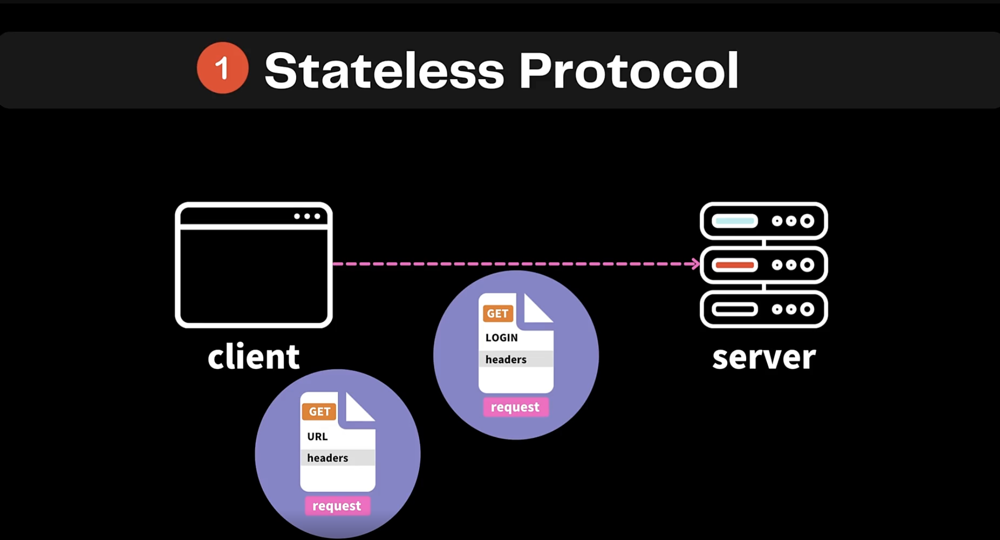

- 그렇기 때문에 세션과 쿠키를 통해서 사용자가 로그인되어 있는 것을 알 수 있다.

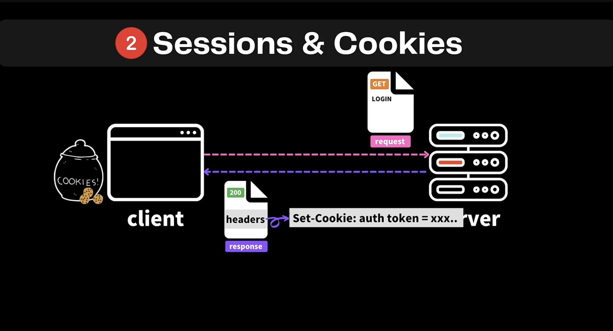

- 이렇게 쿠키를 받으면 브라우저가 자동으로 저장하고 있다가 다음에 요청을 할 때 요청 헤더에 똑같은 쿠키를 넣어서 서버에 보내게 된다.

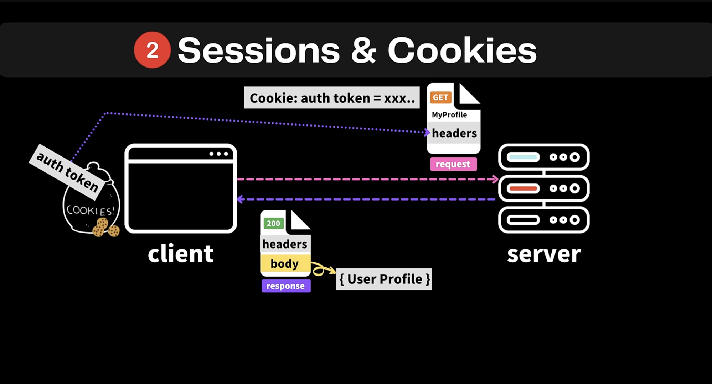

- 그리고 cache control도 할 수 있다

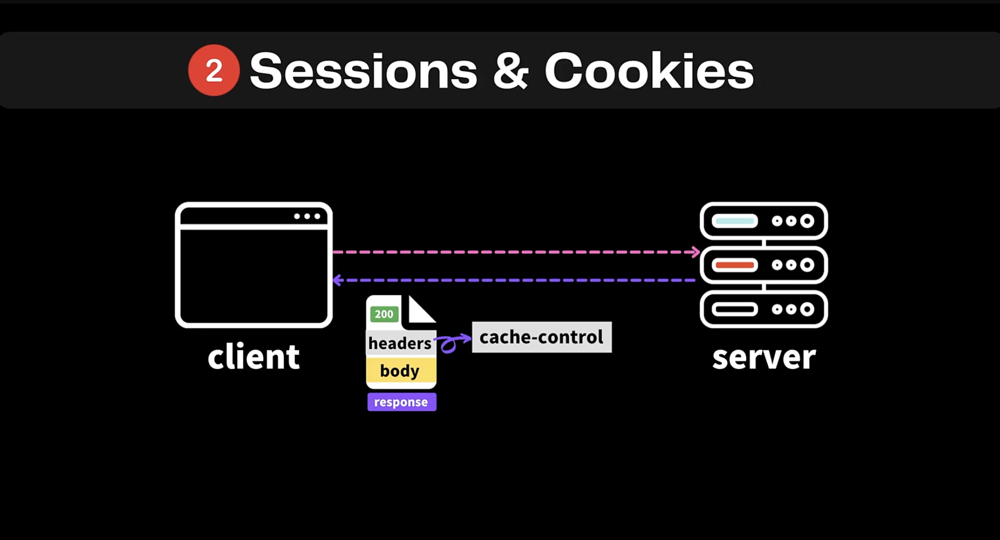

<br/>

- 헤더는 표준적인 헤더와 커스텀 할 수 있는 헤더도 있다.

- 예전에 커스텀 헤더는 `x-auth` 이런 식으로 x로 시작하도록 사용했지만 더 이상 권고되지 않는다

- 표준 헤더중에서 x로 시작되는 것이 있기 때문

- 그렇기 때문에 이제는 domain-key, domain.key 이런 식으로 사용해야 한다

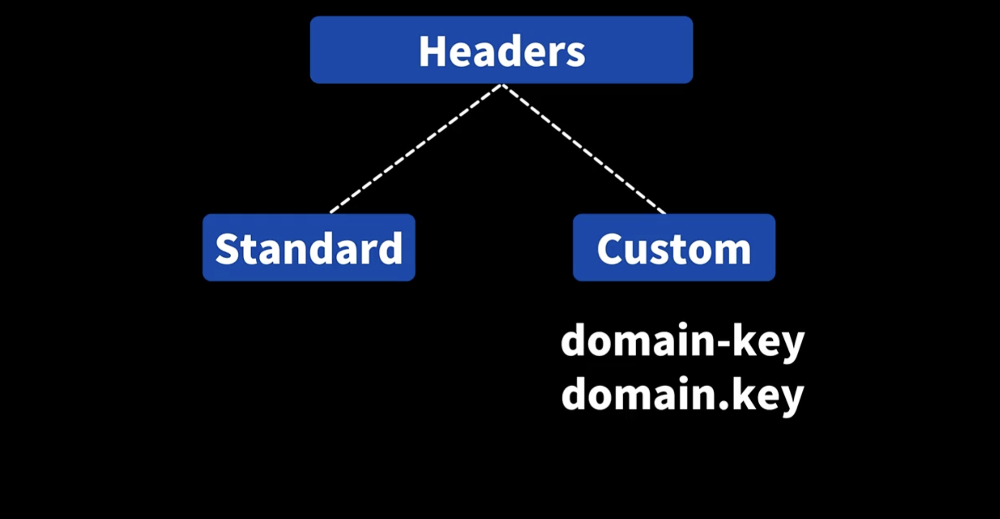

- auth 토큰도 x-auth가 아닌 표준화된 Authorization이라는 헤더를 사용한다

<br/>

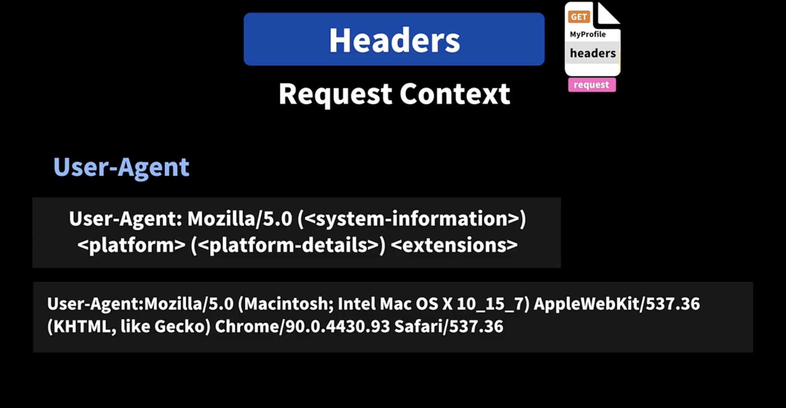

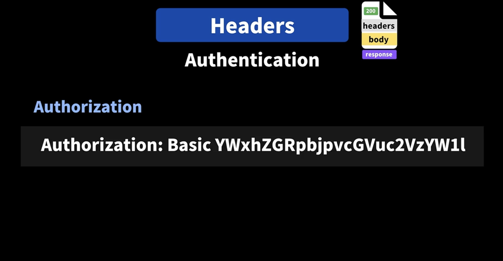

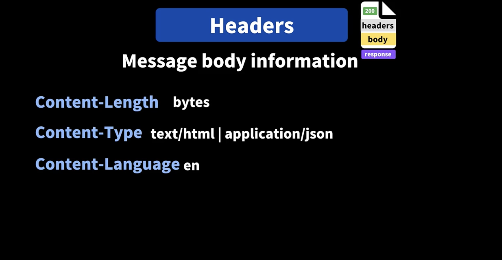

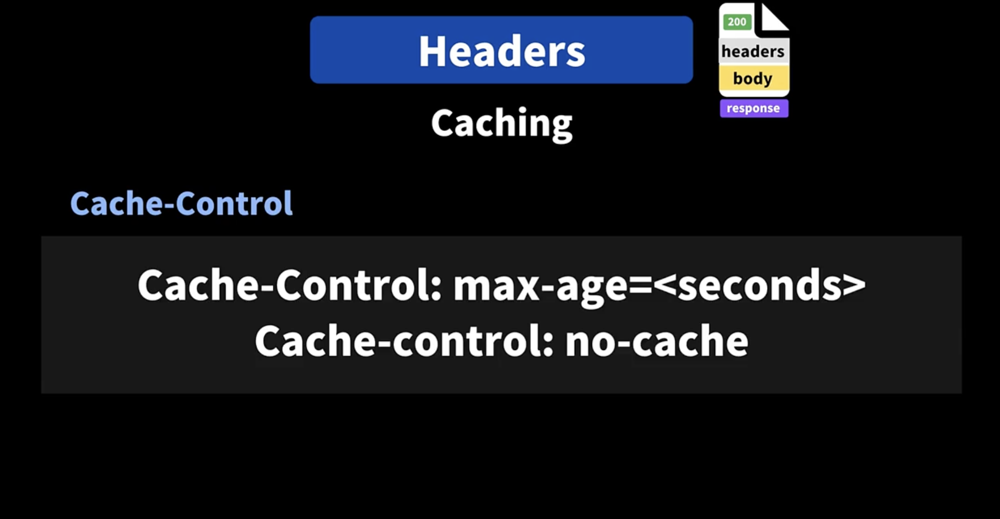

- Reference

  - https://developer.mozilla.org/en-US/docs/Web/HTTP/Headers

  - https://developer.mozilla.org/ko/docs/Web/HTTP/Headers (한국어 버전)
