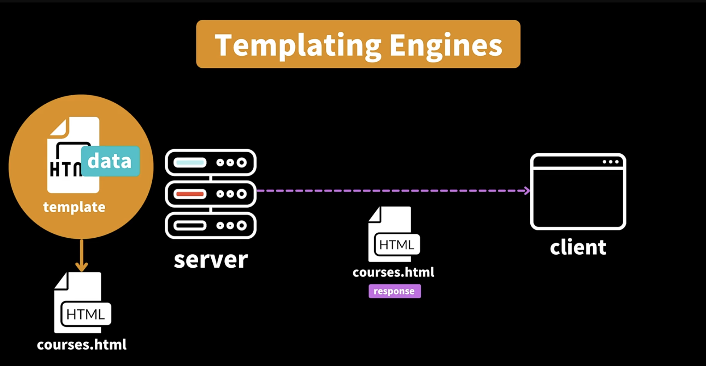

## 9.3 HTML 컨텐츠 보내주기

### Q.

- res.write로 작성할 때는 왜 res.end()를 해야지만 작동하고 pipe.(res)로 할 때는 res.end()를 하지 않아도 되나요?

### A.

- pipe 내부에서 자동으로 처리해 주기 때문입니다

 

- readFile vs createReadStream

  - https://www.geeksforgeeks.org/difference-between-readfile-and-createreadstream-in-node-js/

### Q.

- createReadStream.pipe() 를 이용한 HTML 가져오기 실습에서

- 코드의 마무리 부분에 res.end(); 를 호출했을때는 내용이 불러와지지 않고, res.end()를 생략했을때는 HTML 내용이 정상적으로 localhost에 표시가 되는데

- 왜 이런 차이가 생기는지 궁금합니다!

### A.

- 앞선 강의에서 설명해주신 것처럼 스트림은 기본적으로 Event Driven 형태로 구현되어 있어요.

  - 파일을 읽으면서 중간중간 이벤트가 발생하고, 최종적으로는 end 이벤트를 호출하게 됩니다. 그리고 res 객체는 내부적으로 WriteStream을 상속하고 있고, 이는 end 메서드를 포함하고 있습니다.

  - 제 생각에는 end 이벤트가 발생했을때 내부적으로 호출하는 메서드가 res.end() 메서드와 동일하기 때문에, 스트림을 읽는 도중에 end 메서드를 호출하면 스트림을 읽는 작업이 완료되기 전에 작업을 해당 끝내버려서 정상적인 결과를 얻지 못하는 것 같습니다.

- 정확하게 잘 설명해 주셨어요~ :) 조금만 덧붙이자면 pipe는 비동기적인 함수 이므로, 호출만 해놓고 (작업이 끝나길 기다리지 않고) 다음 코드 라인으로 넘어가죠.

  - 그래서 piping이 되고 있는 중간에 res.end를 호출하게 되면 파이핑이 멈추게 된답니다.

  - pipe이 끝나면 자동으로 end() 처리가 되므로, 수동적으로 호출해줄 필요는 없어요 🙌

---

## 9.4 템플릿 엔진 EJS 사용해보기 (서버사이드 렌더링)

- Templating Engines을 이용하면 html 처럼 생긴 문서의 뼈대만 구성해 놓고

- 즉 템플릿만 만들어 놓고 클라이언트가 요청하면 요청에 맞게 페이지를 동적으로 만들어서 클라이언트에게 보내줄 수 있다

- 그 중에서도 EJS가 보편적으로 사용된다

- 순수 자바스크립트 되어있을 때는 Templating Engines 사용해도 상관없지만 조금 더 복잡한 서버 사이드 렌더링 하려면 Next.js 같은 프레임워크 사용한다

- Reference

  - [EJS](https://ejs.co/)
