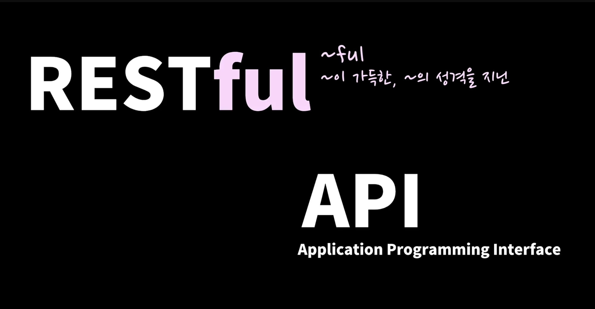
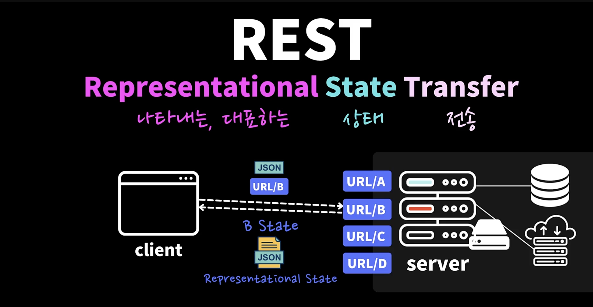
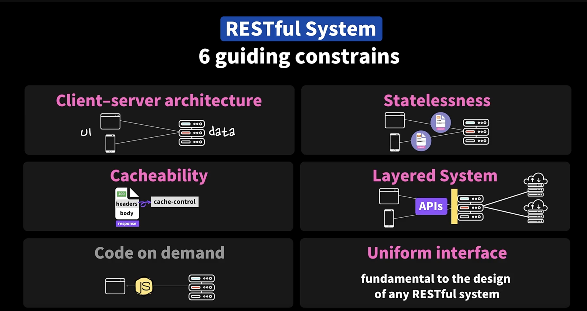
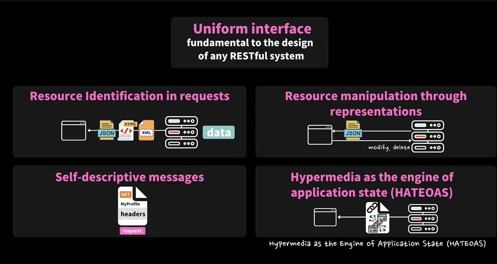
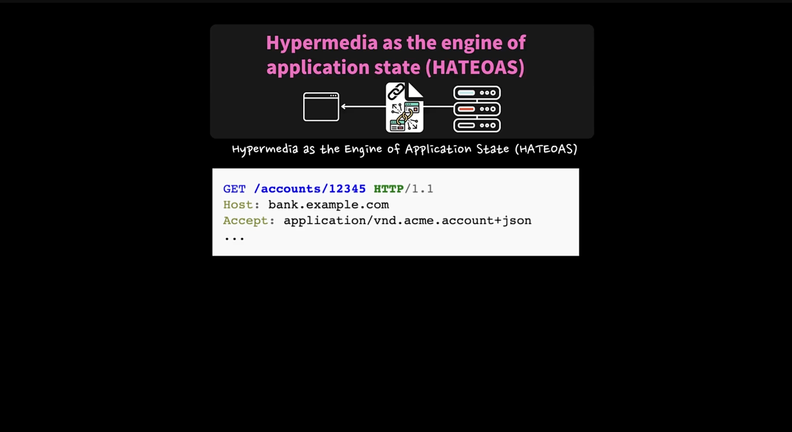
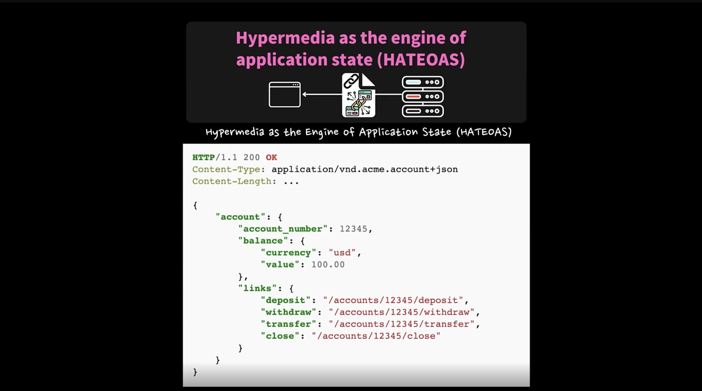

## 10.2 진정한 Restful API 도대체 뭘까?



- REST는 무엇인가 나타내는, 대표하는 상태를 전송하는 것을 말한다



- 클라이언트가 URL/B를 요청하면 B에 해당하는 상태를 서버는 응답으로 보내준다

  - 예시에서 B 상태는 JSON을 요청하면 JSON을 대표하는 상태를 보내준다

<br/>

- REST라고 하는 것은 Software Architectural Style

  - 즉, 서버 소프트웨어 아키텍쳐를 디자인할 수 있는 스타일을 말한다

  - 그렇기 때문에 웹 서비스를 만들 때 지키면 좋은 가이드라인 (Web Service Guidelines)

- 즉, HTTP 로 서버와 클라이언트가 통신할 때 어떻게 효율적으로 잘 디자인 할 수 있을까 고민해서 고안해낸 것


<br/>



1. 서버는 클라이언트가 브라우저이던지 모바일이던지 다양한 어플리케이션에 데이터를 제공할 수 있는 아키텍쳐를 유지해야 한다

2. Stateless한 상태로 서버를 디자인 해야 한다

3. 캐시가 가능하다면 캐시가 가능하도록 디자인 한다

4. Layered System을 이용해서 클라이언트가 서버에게 얼마나 많은 서버가 있는지 또는 서버 사이에 게이트웨이 서버가 있던지 없던지 상관없이 즉, 공통된 서버에서 제공하는 API 하나로 뒤에 얼마나 많은 서버가 있는지 상관없이 하나의 API를 사용할 수 있도록 Layered System을 만들어야 한다

5. 클라이언트가 원한다면 클라이언트에서 수행해야 하는 코드를 서버에서 클라이언트에서 서버로 보내줄 수 있다 (옵션인 가이드)

6. Restful 인지 아닌지 판단하는 요소. 아래에서 자세히 설명

- 2, 3번은 HTTP 프로토콜에서 자동으로 얻어갈 수 있다

<br/>



1. 클라이언트 요청에서 서버에 있는 어떤 리소스를 원하는지 식별할 수 있어야 하고 서버에 어떤 형태로 데이터가 저장되어 있던지 상관없이 클라이언트가 이해할 수 있는 형식으로 보내주어야 한다

2. 서버로 부터 받은 해당 도메인을 대표할 수 있는 데이터를 통해 해당 리소스에 대해서 어떻게 더 처리할 수 있는지에 대한 모든 정보를 알아야 한다

   - 앞으로 수정이나 삭제 할 때 어떤 식으로 요청해야 하는지 알 수 있어야 한다.

3. 서버에서 보내는 응답 데이터 안에는 반드시 클라이언트가 이 데이터를 어떻게 처리해야 하는지 설명이 되어 있어야 한다.

   - 예를들어 데이터 타입은 무엇인지에 대한 정보 있어야 한다 (ex. Http 헤더의 Content-type)

4. Hypermedia를 application state 엔진처럼 제공해야 한다

   - 우리가 서버에서 url이 있다면 클라이언트가 서버에 아떤 Url이 있는지 알아야 하고 적절한 url로 요청을 해야 한다

   - 잘못된 url로 요청하면 404를 받으니까

   - 클라이언트 측에서 신경써서 url을 요청해야 한다

   - 아래 예시처럼 클라이언트가 서버에 accounts에 관한 걸 하고 싶다고 요청한다고 하자

  

  

- 그러면 서버에서 이 accounts로 할 수 있는 모든 액션에 대해서 어떤 url을 써야 되는지, 앞으로 어떤 url을 이용해서 서버에 요청을 할 수 있는지 다 링크된 url을 응답으로 보내준다

- 그러면 클라이언트에서 받은 이 리스트를 이용한다

- 예를들어 deposit을 하고 싶다면 이 url을, withdraw를 하고 싶다면 이 url을 사용하면 되구나 라는 정보를 받아 온다

- 즉, 서버로 부터 어떻게 서버를 이용하면 되는지 모든 정보를 얻어온다

- 이것을 RESTful api라고 한다

- 진정한 RESTful 시스템을 따라가는 서버를 만들려면 url을 잘 디자인하는 것 뿐 아니라 이렇게 hypermedia를, 즉, 모든 링크들을 클라이언트에 제공해줌으로써 클라이언트가 서버에 어떤 url이 있는지 일일이 확인할 필요 없이 제공해주어야 한다

<br/>

- 우리가 이런 모든 규칙을 다 지키는 것은 아니다. 특히 Hypermedia 4번은 많은 곳에서 하지 않는다

- Reference

  - Rest에 대한 정리가 필요하시면 여기 위키 페이지가 도움이 되실것 같아요:

    - https://en.wikipedia.org/wiki/Representational_state_transfer

<br/>

### Q.

- 설명해주신 Uniform interface의 4가지 특징 중에

- 첫번째 1. Resource Identification in requests를 제외한

- 2. Resource manipulation through representations

- 3. Self-descriptive messages

- 4. Hypermedia as the engine of application state

- 위의 3가지 특징 간의 차이점이 무엇인지 명확하게 잘 모르겠습니다.

- 모두 다 "추가적으로 어떤 처리를 어떻게 할 수 있는지 알려줘야한다"라는 특징...?으로 이해했는데

- 3가지 특징간의 차이를 더 구체적으로 설명해주실 수 있을까요

### A.

- 4가지다 비슷한 내용이예요. 클라이언트가 해당 도메인에 필요한 모든 내용들을 다 또는 도메인을 대표하는 모든 상태에 대한 정보들을 다 받아갈 수 있도록 만드는것.

- 이것이 포인트가 아닐까 해요 :)

2. 요청한 데이터에 대해 삭제, 수정시 필요한 URL을 포함해서 제공해 주기

3. 서버의 반응 데이터를 어떤 포맷으로 해석할 수 있는지 스스로 설명할 수 있도록 메시지를 만들기 (Content-type: json 같은)

4. 이건 영상에서 제가 충분히 설명해 드린 것 같아요 :)

---

## 10.3 Web APIs 디자인 💩 vs ✨

- 앞의 RESTful 방식대로 하지 않고, 대부분 서버들이 Web API를 디자인할 때는 CRUD 라는 기본적인 기능을 지원해주면 된다

- Create -> POST

- Read -> GET

- Update -> PUT

- Delete -> DELETE

<br/>

- /posts/getPosts (GET) -> /posts (GET)

- /posts/createPosts (GET) -> /posts (POST)

---

## 10.4 보통의 Rest APIs 예제 (기업 사례)

- https://developers.google.com/youtube/v3/docs/videos/list

  - 이런 문서를 통해 다른 기업은 어떤식으로 API를 제공하는지 알 수 있다

  - 보면 앞서 배운 RESTful API 원칙 6가지 중 hypermedia 링크를 제공해주어야 한다는 원칙이 지켜지지 않은 것을 확인할 수 있다.

  - 그렇기 때문에 사용자는 어떠한 API로 요청을 해야 하는지 url을 다 알고 있어야 한다

  - 이 API도 나쁘지 않다. 통상적으로 사용되는 RESTful API 방식

---

## 10.5 진정한 Rest APIs 예제 (기업 사례)

- https://developer.github.com/v3/

  - RESTful API 원칙을 따른 좋은 사례

- https://docs.github.com/en/rest/pulls/pulls?apiVersion=2022-11-28#get-a-pull-request

  - Response 보면 아래처럼 여러가지 기능별로 다른 url이 제공되는 것을 확인할 수 있다.

  - 즉, 해당 도메인과 연관된 사용가능한 모든 url에 대한 정보가 함께 제공된다

  ```shell
  ...

  "html_url": "https://github.com/octocat/Hello-World/pull/1347",
  "diff_url": "https://github.com/octocat/Hello-World/pull/1347.diff",
  "patch_url": "https://github.com/octocat/Hello-World/pull/1347.patch",
  "issue_url": "https://api.github.com/repos/octocat/Hello-World/issues/1347",
  "commits_url": "https://api.github.com/repos/octocat/Hello-World/pulls/1347/commits",

  ...

  ```

- 사실 이런 것은 드문 케이스로 이렇게 하는 곳 많지 않다

<br/>

### Q.

- restful api 예시에서는 생성, 수정, 삭제와 같은 기능들이 하나씩 처리하는 것을 예시로 볼 수 있는데 만약 동시에 이뤄지는 기능이 필요하다면 어떻게 처리가 가능할까요?

- 예를 들어 회원 가입시 아이디 중복 체크

- 성공시 아이디 생성 과 같은 경우 어떻게 만들어야 할까요?

### A.

- 보통 회원가입같은 경우 아이디 생성 Rest API에서 중복되는 아이디가 있다면 409 에러 코드를 보내준답니다.

- RestAPI에서는 도메인 별로, 최대한 작은 단위로 API를 만드는것이 권장되고 있어요.
