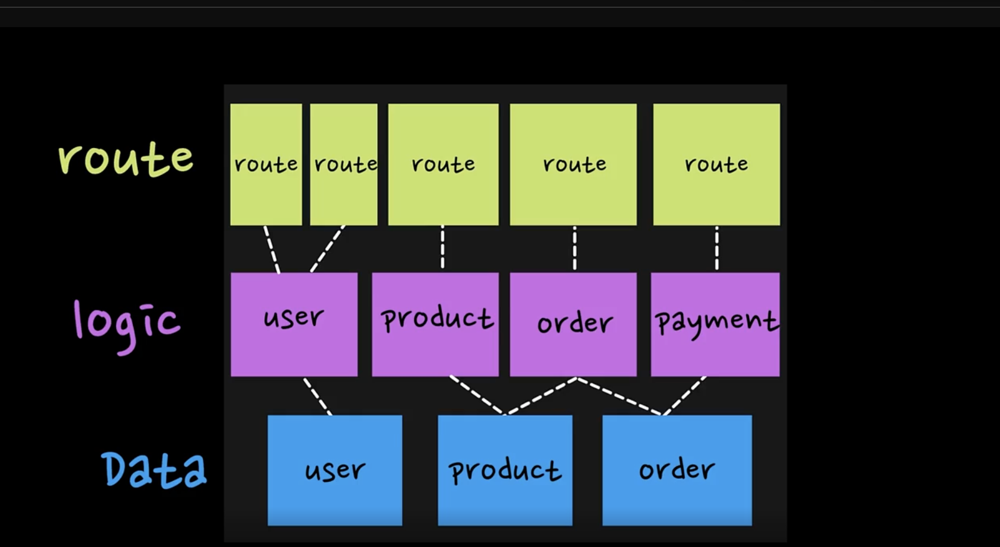

## 13.1 MVC 패턴이란? 서버에 어떻게 활용할까?

### MVC

- Model, View, Controller 로 프로젝트의 아키텍쳐를 만들어나가는 것을 말한다

- Model

  - 어플리케이션에서 필요한 데이터를 담고 있다.

- View

  - 사용자 에게 보여지는 UI 단

- Controller

  - Model과 View를 연결하는 비즈니스 로직이 들어있다

  - View에서 특정한 이벤트 발생하면 Controller로 전달한다

  - 옵션 사항이지만 여기서 유효성 검사를 한다.

  - Model을 업데이트 하고 읽어온 다음 View에 전달해준다

 

- MVC 패턴은 서버에서도 사용할 수 있다

- 서버에서 view는 라우터와 밀접하게 관련이 있다

- 라우터에서 특정한 요청이 발생하면 해당 컨트롤러에 요청을 하고

- 컨트롤러가 모델에게 데이터를 읽거나 쓰고, 컨트롤러가 가지고 있는 데이터를 라우터에 보내주는 방식으로 동작한다

 

## 13.4 서버에 Controller 층을 만들어 보기 💡

- 좋은 질문이예요 👍

- 우선, Router에 무명함수 (이름이 없는 함수)로 등록된 함수들을 Controller라는 모듈로 각각 이름을 부여해서 추출해 두었어요. 라우터 정보도 한눈에 보이지만, controller 모듈에 각각의 기능들이 이름이 부여되어 있어서 재사용성도 높아진걸 확인해 볼 수 있죠 :)

- 익스프레스의 라우터 구현사항과 개별적으로 모듈로 분리해둔것의 장점은

  - 가독성 향상

  - 높은 재사용성

  - 높은 테스팅 (테스팅을 작성할때 express 프레임워크의 디펜던시가 필요없음)

- 정리를 해보면

- 첫번째, 라우터는 말그대로 주어진 경로에 대해 어떤 함수를 연결할건지 용도로만 사용해야 합니다. 라우터 자체가 다른 구현사항이나 서비스의 비지니스 로직을 가지고 있으면 라우터라는 순수 역활에서 벗어나서 그 이상의 것을 하게 되는거죠.

- 두번째, 이렇게 컨트롤러를 분리해서 만들어 두면, 다른 라우터 (경로)에서 동일한 처리를 해야 하거나 또는 여러가지를 복합적으로 처리 해야 한다면 컨트롤러에 정의된 함수를 재사용할 수 있어요. 라우터마다 동일한 코드를 중복적으로 작성하지 않아도 되죠

- 세번째, 나중에 익스프레스 말고 다른 노드 프레임워크르 사용한다고 결정이 되면, 기존의 컨트롤러 코드를 그대로 재사용 할 수 있어요 :) 짱 간편하겠죠? :)

- 보너스 챕터 Swagger에서 스와거용 미들웨어를 사용하는데 지금 이렇게 컨트롤러로 분리해 두었기 때문에 간편하게 재사용 할 수 있답니다

- 마지막으로, 앞에서 언급한 것처럼 테스팅 코드를 작성할때 코드가 프레임워크에 크게 의존적으로 되어 있으면 개별적인 유닛테스팅을 작성하기 어려워요. 익스프레스 프레임워크를 테스팅하는것이 아니라, 우리의 비지니스 로직을 테스트 해야 하므로 이렇게 컨트롤러로 작성해 두면 유닛테스팅을 작성하기가 좋아요 ;)

### Q. 데이터 계층을 따로 두고 관리하는 것은 충분히 합리적이고, 필수적이라고 느껴집니다.

- 하지만 컨트롤러의 경우에는 현재 코드에서는 사용에 대한 이점이 라우터 정보를 한눈에 볼 수 있다. 정도 밖에는 느껴지지 않습니다. 이렇게까지 나누는 또 다른 이유가 있을까요?

- 프로젝트를 관리하다보면 조금 과한 모듈화로 인해서 유지보수의 불편함을 겪을 때가 많은데, 잘 납득이 가지 않습니다.

### A.

 

### Q. controller 함수에서 비즈니스 로직을 관리하는 함수들을 따로 정의한 마당에 data/tweet.js의 함수들이 왜 필요한지? 어떤 차이로 구분을 해야하는지 궁금합니다.

- 이번 강의를 들으면서 실무에서 어떻게 사용하는지, 어떻게 모듈화를 하는지 이해할 수 있어 좋았어요 :)

- 저는 아직 이해가 될듯 말듯한 부분이..

- data와 controller의 함수입니다.

  - router는 /tweets로 접속했을 때 어떻게 라우팅을 하는지 controller에서 정의한 각 함수로 연결하는 역할. 해서 인자를 전달하는 함수()형태가 아니라 함수 만 전달

  - controller에서는 로직을 관리하는 함수를 정의하고, 데이터 관리 파일인 data.js을 import해서 그 데이터들을 컨트롤 하도록 함
  - data/tweet.js에서는 데이터 배열과 해당 데이터들을 관리하는 함수들을 정의하는 파일

### A.

- data는 데이터베이스나 클라우드에서 데이터를 읽어오는 순수한 읽기/쓰기 전용 로직이 들어가요

- controller는 그 외에 이 데이터를 가지고 어떤 일들을 별도로 해줘야 하는지, 누가 읽을 수 있는 권한이 있는지, 어떤 로직으로 데이터를 읽고/쓰고/변경할 건지 등등 비지니스 로직을 담당해요

 

## 13.7 프론트엔드 코드 개선 - 재사용성💡

### Q. 의존성에 대해 질문이 있습니다!

- 안녕하세요! 강의를 정말 즐겁게 듣고 있는 수강생입니다:)

- 제가 프론트엔드 수업은 수강하지 않아서 아직 의존성에 대해 잘 이해하지 못해서요...

1. 왜 service/tweet.js 에서 import로 HttpClient를 바로 사용하지 않고 index.js를 거쳐서 constructor를 통해 사용하는지

2. service/tweet.js에서 http가 아닌 this.http로 httpClient를 사용하는 이유가 무엇인지 궁금합니다!

- 혹시 제 질문이 많이 부족하다면 어떻게 검색해서 공부하면 좋을지 방향성만 살짝 알려주실 수 있을까요?

- 정말 필요한 부분만 친절하게 쏙쏙 알려주시는 강의 늘 감탄하면서 수강하고 있어요. 항상 감사합니다:))))

### A.

1. 의존성 주입은 여기에서 자세히 나와있어요:

   - https://ko.wikipedia.org/wiki/%EC%9D%98%EC%A1%B4%EC%84%B1_%EC%A3%BC%EC%9E%85#:~:text=%EC%86%8C%ED%94%84%ED%8A%B8%EC%9B%A8%EC%96%B4%20%EC%97%94%EC%A7%80%EB%8B%88%EC%96%B4%EB%A7%81%EC%97%90%EC%84%9C%20%EC%9D%98%EC%A1%B4%EC%84%B1%20%EC%A3%BC%EC%9E%85,%EC%9D%84%20%EC%A0%9C%EA%B3%B5%ED%95%98%EB%8A%94%20%ED%85%8C%ED%81%AC%EB%8B%89%EC%9D%B4%EB%8B%A4.&text=%EC%9D%98%EC%A1%B4%EC%84%B1%20%EC%A3%BC%EC%9E%85%EC%9D%98%20%EC%9D%98%EB%8F%84%EB%8A%94,%EC%BD%94%EB%93%9C%20%EC%9E%AC%EC%82%AC%EC%9A%A9%EC%9D%84%20%EB%86%92%ED%98%80%EC%A4%80%EB%8B%A4.

- 추가하자면: 다른 하위 컴포넌트에서 필요한 인스턴스를 직접 만들어서 사용하면,

- 컴포넌트가 다시 만들어 질때마다 계속적으로 인스턴스가 만들어 지겠죠?

- 그리고 나중에 동일한 인터페이스 이지만 다른 구현사항이 생기면, 필요한 다른것으로 교체 하기 위해서는 컴포넌트 내부 코드를 수정해야 하는 문제점이 있어요 :)

2. this.http는 클래스에서 멤버 변수에 접근하기 위해서는 this. 를 붙여 주셔야 해요 :)

- https://developer.mozilla.org/ko/docs/Web/JavaScript/Reference/Classes
