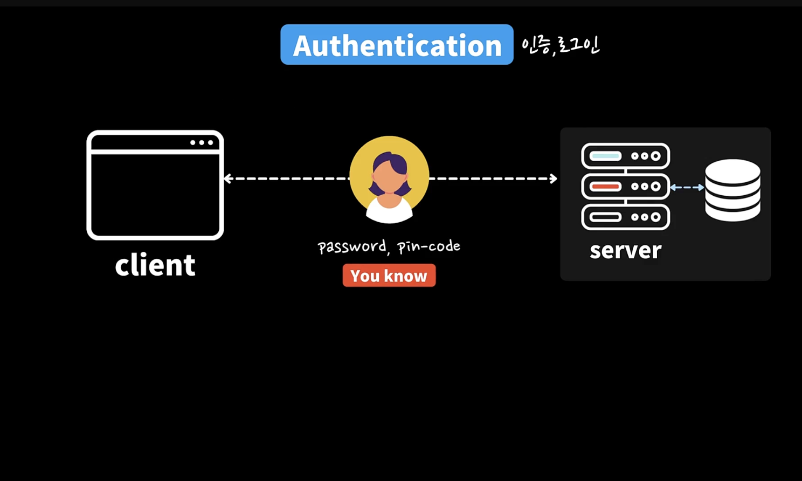
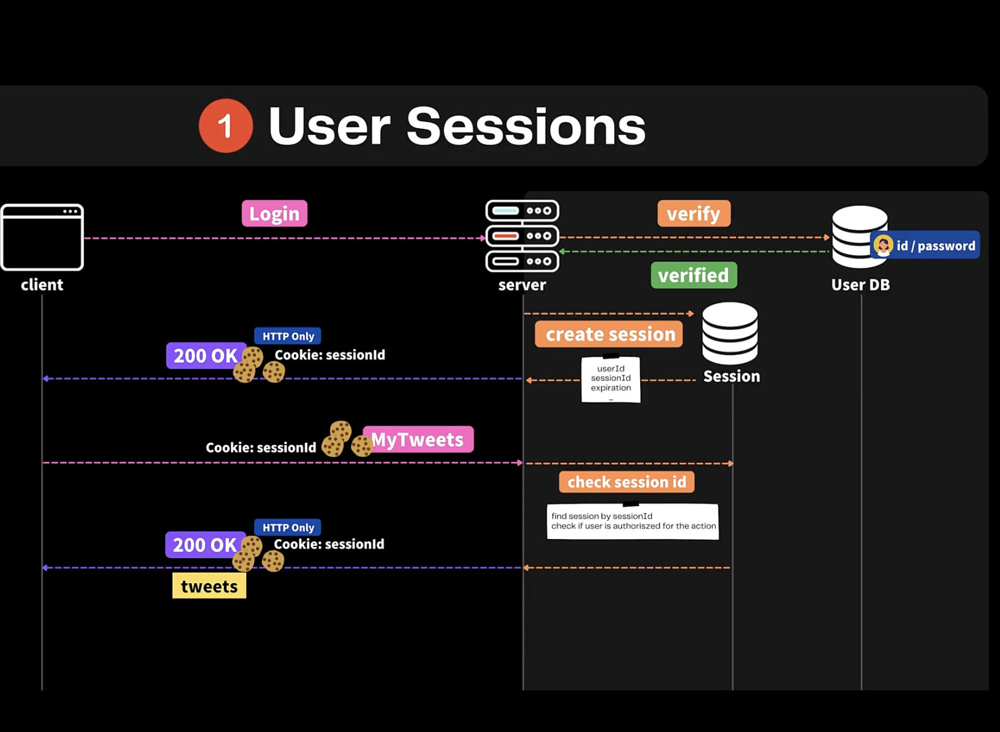
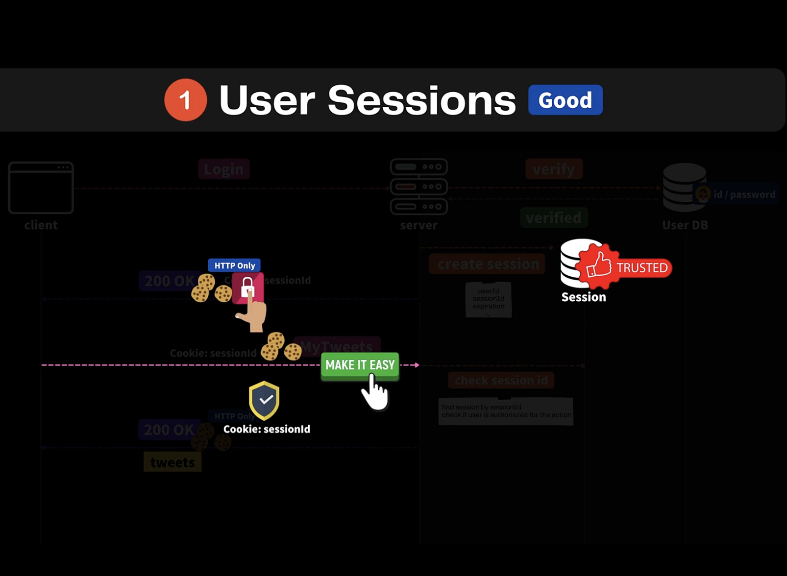
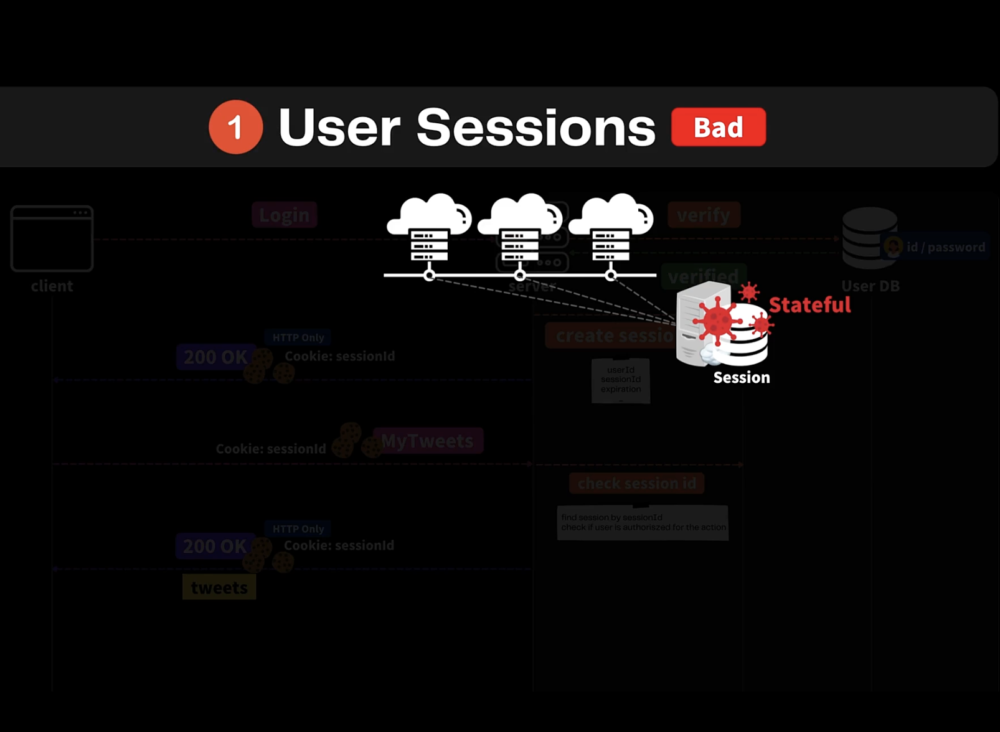
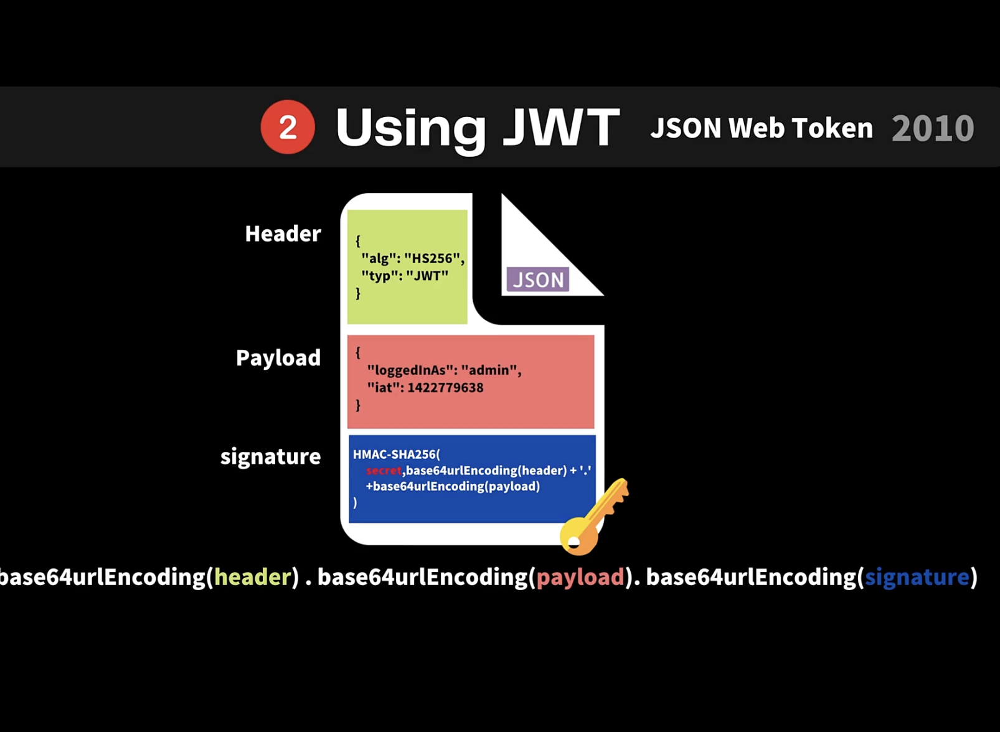
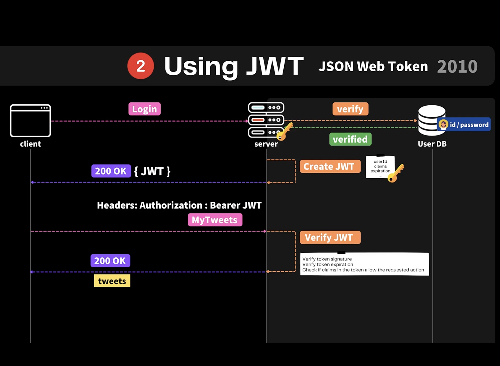
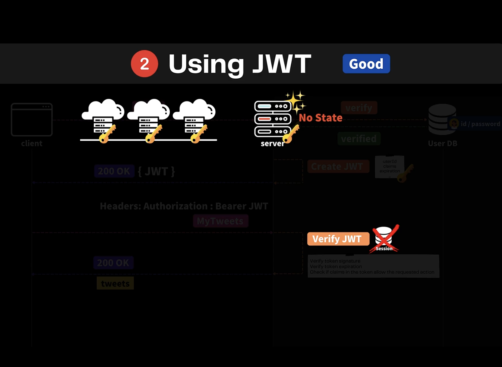
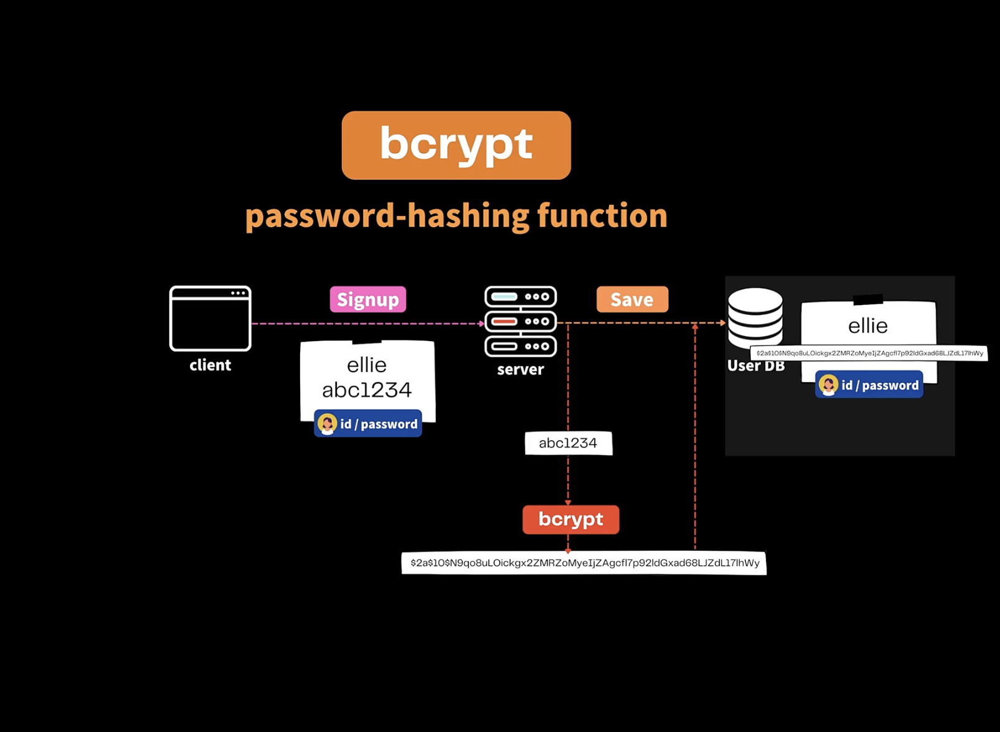
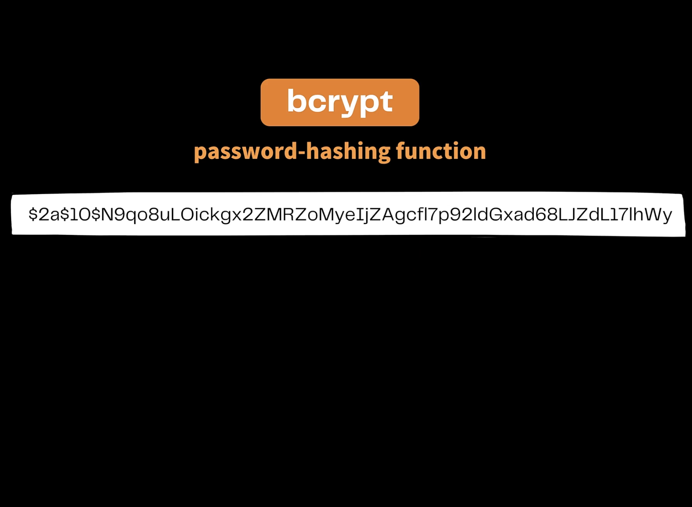

## 15.2 인증이란 무엇인가?

- You know, You are, You have를 통해서 인증할 수 있다.

- 통상적으로는 You know를 통해서 한다

 

## 15.3 세션과 쿠키란? 장/단점

1. 클라이언트가 서버에 로그인(Login) 하게 되면 서버는 데이터베이스에 해당 정보가 있는지 확인한 다음(verify), 유효한 사용자(verified)라면 세션을 만든다(create session).

2. 세션에는 사용자의 아이디, 세션의 아이디 그리고 세션이 얼마동안 유효한지를 간직하고 있다.

3. 이 별도의 세션 정보를 Session이라는 데이터베이스에 저장해둔다

   - 데이터베이스 일 수도 있고 파일 시스템에 저장하거나 메모리 상에 보관할 수도 있다.

   - 통상적으로 데이터베이스에 저장

4. 그리고 클라이언트에 세션 정보를 보내준다(200 OK)

   - 보통은 쿠키에다가 정보를 넣어서 보내주게 된다

   - HTTP Only라는 옵션을 주면 해당 쿠키는 브라우저를 통해서만 읽을 수 있다

   - 즉, 자바스크립트나 프로그램 내에서는 볼 수 없다

5. 쿠키를 이용해서 클라이언트가 서버에 다른 요청을 할 때 브라우저에서 자동으로 쿠키를 포함해서 주기 때문에 (My Tweets),

6. 클라이언트에서 보내준 세션 아이디를 통해서 세션 데이터 베이스에 존재하는 아이디 인지, 혹시 만료된 세션은 아닌지 검토한 다음, (check session id)

7. 유효하다면 세션 아이디를 통해서 사용자가 누군인지 파악해서 관련된 데이터를 파악해서 사용자에게 보내준다 (200 OK tweets)

 

### 세션과 쿠키 방식의 장점은

- 세션이라는 데이터 베이스에 모든 세션에 대한 정보를 보관할 수 있으므로 신뢰할 수 있는 데이터가 있다

- 쿠키를 사용하기 때문에 서버에서 보낼 때도 쉽고 클라이언트에서도 별도로 처리하지 않아도 브라우저에서 해줄 수 있으므로 간단하게 구현할 수 있다

- HTTP Only 옵션을 사용한 경우 안전하게 보완성을 높여서 사용할 수 있다.

- 사용자에게 사용자에 대한 정보를 보내는 것이 아닌 세션 아이디를 보내기 때문에 이 사용자가 누구인지 다른 정보를 주고 받지 않으므로 안전하다고 볼 수 있다.

### 세션과 단점

- 세션에서 시시각각 변하는 로그인하는 사용자에 대해서 세션에 정보를 보관하고 있으므로 서버에 상태가 있고

- 이것 때문에 서버를 확장해서 여러개의 서버에서 동작하도록 하던지 아니면 마이크로 서비스를 하는 경우에 한 서버에 세션을 보관하고 있기 때문에 다양한 많은 서버가 세션의 정보를 확인하기 위해 하나의 서버에 접속해서 네트워크 요청을 해야 한다.

- 즉, 클라이언트 요청을 처리하기 위해 내부적으로 여러가지 네트워크 요청을 해야돼서
  시간이 많이 걸릴 수 있고

- 분산형 시스템으로 서비스를 잘 디자인 했음에도 불구하고 세션 때문에 성능이 좋지 않은 경우도 있다

 

## 15.4 JWT란? 장/단점

- 세션과 쿠키를 대체해서 사용할 수 있는 방법

- JSON 객체에 사용자와 관련된 Auth와 관련된 모든 정보가 있다

- Header

  - 사용하는 알고리즘과 타입에 대해서 명시

- Payload

  - 전송하고 주고받고 싶은 다양한 데이터

- signature

  - 다만 위와 같은 정보들은 인코딩 되어 보안 처리되기 때문에 그냥 보면 이해할 수 없다

  - signature 안에는 우리가 인코딩한 헤더와 페이로드 뿐 아니라 이것을 인코딩 하기 위해 사용하는 서버의 비밀키, 시크릿이라는 것을 이용해서 함께 인코딩 헤두었다

  - 이렇게 서버에서만 사용하는 시크릿과 함께 인코딩을 해둠으로써 나중에 사용자가 악의적으로 페이로드에 있는 정보를 바꾼다던가 하면 해당 내용이 변경되었는지를 확인할 수 있다.

- 한마디로 JWT는 JSON이라는 파일안에 필요한 모든 데이터를 넣어서 주고받을 수 있는 것

- 안전한 이유는 시크릿이라는 통해서 인코딩을 하기 때문에 정보의 유효성을 확인할 수 있다

 

1. 사용자가 로그인하고 (Login)

2. 유효한 사용자라면 (verify, verified)

3. 사용자의 아이디와 우리가 원하는 정보를 묶어서 JWT를 만들고 (Create JWT)

4. 그리고 JWT를 사용자에게 보내주게 되고 (200 OK)

5. 사용자는 추후에 하는 API 요청에 대해 서버에 JWT를 포함해서 보내게 되면 (MyTweets)

6. 서버에서는 클라이언트에서 받은 JWT를 이용해서 전달받은 JWT가 유효한지 아닌지, 수정이 되었는지 아닌지, 만료되었는지 아닌지 사용자에 대한 정보가 정확한지 아닌지에 대한 유효성 검사를 한 다음에 (Verify JWT)

7. 해당하는 데이터를 사용자에게 보내주게 된다 (200 OK)

### JWT의 장점

- 서버에 상태가 없다

- 세션을 이용할 대는 세션이라는 별도의 상태가 필요했다면 JWT는 한번 만들어서 클라이언트에 보내주고 다시 검증하기만 하면 되기 때문에 별도의 상태를 필요하지 않고

- 그렇기 때문에 서버를 화장하거나 마이크로서비스를 이용하거나 분산형 시스템으로 만들어도 서로 서버간에 네트워크 요청을 통해 사용자에 대한 검증을 하지 않아도 JWT를 만들고 해독할 수 있는 동일한 시크릿 키만 가지고 있으면 된다

### JWT의 단점

- JWT 그 자체가 단점이 될 수 있다

- 서버와 클라이언트 간에 계속해서 중요한 JWT에 대해서 주고 받아야 하기 때문

- 영원히 만료되지 않는 JWT를 서로 주고 받는다면 해커가 이 정보를 그대로 가져와서 악용할 수 있다

- 그렇기 때문에 JWT를 사용할 때도 보안에 신경써서 사용해야 한다

 

### Q.

1. 2분 52초 flow를 보면 jwt를 body에 담아서 주는 거 같은데 탈취의 위험은 없을까요???

2. 제가 예전에 사이드 프로젝트를 진행했을 때 인증 부분을 JWT로 진행했었는데요. 그 때는 accessToken을 body에 넣어주고 refreshToken을 cookie에 담아서 줬었는데, 시간이 지나고 강의를 보니 왠지 accessToken을 http-only cookie에 담아서 주고(탈취를 방지하기 위해) refreshToken은 서버에서 관리를 하는게 맞다고 개인적으로 생각하고있어요...!

- 그리고 또 refreshToken은 없어도 된다! 이런 말도 많더라고요 그래서 더욱 더 헷갈리는 것 같아요

### A

- 오 좋은 질문 이예요 🙌 이 부분은 보너스 챕터 보안편에서 정말 심도있게 다루고 있고 또 그에 맞게 프로젝트를 개선 하고 있으니깐 그 챕터 보시면 많은 궁금증이 해소될것 같앙요 :)

- 그거 보시고 또 궁금한거 있으면 또 질문 부탁드려요 🙏

 

## 15.5 bcrypt란?

- bcrypt는 패스워드를 안전하게 보관할 수 있도록 해싱하는 알고리즘

- 사용자가 가입할 때 입력한 아이디와 비밀번호를 그대로 데이터 베이스에 저장하면 해커가 우리 데이터메이스에 접근해서 사용자의 아이디와 비밀번호를 훔쳐갈 수 있기 때문

- 하지만 bcrypt를 통해서 암호화 알고리즘을 통해서 다른 방식으로 해싱을 해서 만들고 이것을 데이터 베이스에 저장해둔다

- Alg

  - 어떤 알고리즘을 사용했는지

- Cost

  - 암호화를 할 때 얼마나 많은 복잡도로 암호화를 했는지

  - 암호화를 할 때의 비용

- Salt

  - 암호화를 할 때 그냥 일반적으로 암호화를 하는 것이 아니라

  - 우리가 원하는 길이 만큼의 더 랜덤한 것을 이용해서 암호화를 복잡하게 만든다

- Hash

  - 최종적으로 암호화된 정보가 모아져 있다.

- bcrypt는 암호화를 하는데만 사용이 가능하고 알고리즘을 통해서 해쉬를 만들 수 있지만 만들어진 해쉬를 가지고 다시 비밀번호로 변환할 수 없다.

- 하지만 Salt를 사용하지 않고 Alt, Cost, Hash 형태로 사용하게 되면 해커들은 특정한 문자열, 예를들어 abc를 넣었을 때 어떤 결과가 나오는지를 알고 이를 통해서 역으로 패스워드를 유추할 수 있다.

- 즉 각각의 문자열에 대한 테이블을 만들어서 패스워드를 유추할 수 있는 것이다

- 하지만 Salt를 사용하게 되면 해커가 가지고 있어야 하는 테이블의 개수가 기하급수적으로 늘어나게 된다

- 만약에 Salt가 a 하나라면, abc 문자열 뿐 아니라 abc그리고 a가 더해졌을 때의 테이블도 필요하다

- 즉, Salt가 늘어난다면 몇년이 걸려야 해독할 수 있게 된다

 

## 15.6 bcrypt 사용해 보기 + 유의 사항

- Salt 길이별로 성능 측정: https://auth0.com/blog/hashing-in-action-understanding-bcrypt/

  - 복잡도가 증가하면 증가할수록 해시를 하는데 걸리는 시간이 기하급수적으로 증가한다

  - 암호화와 관련된 것은 계산하는 것이기 때문에 CPU를 사용하므로 지나치게 값을 크게 하면 좋지 않다

  - 보통은 8~12 정도를 추천하고 있다.

### Q. bcrypt와 관련해 nodejs에 내장된 crypto 라는 모듈에 대해 질문드려요

- 공부하면서 crypto 라는 모듈을 접하게 됐는데 수업 범위를 넘어가기도 하는 거같아 질문하는게 조심스럽긴한데요...제가 이해한게 맞는지 확인하고 싶습니다~!

- crypto에서는 salt생성 > password와 salt를 함께 해쉬> salt와 해쉬된 password를 모두 db에 저장

- bcrypt에서는 위과정을 한번에 처리하여 해쉬된 password와 salt정보가 포함된 객체가 db에 저장

- 이렇게 이해하면 될까요??

### A.

- 넵, 맞아요.

- bcrypt는 해쉬된 결과에 salt와 관련된 정보가 모두 포함되어져 있어요, 문서:

  - https://github.com/kelektiv/node.bcrypt.js/blob/master/README.md#hash-info

- DB에 저장할때 hash만 저장해도 salt정보도 자동 포함되죠.

- 대부분의 crypto는 salt는 포함되지 않기 때문에 DB에 따로 저장하거나, 또는 하나의 데이터로 묶어서 저장할 수 있어요. (.이나 , 토큰으로 뭉침) 예제: https://stackoverflow.com/a/67038052/985942

 

## 15.7 JWT 사용해 보기

- https://jwt.io/
