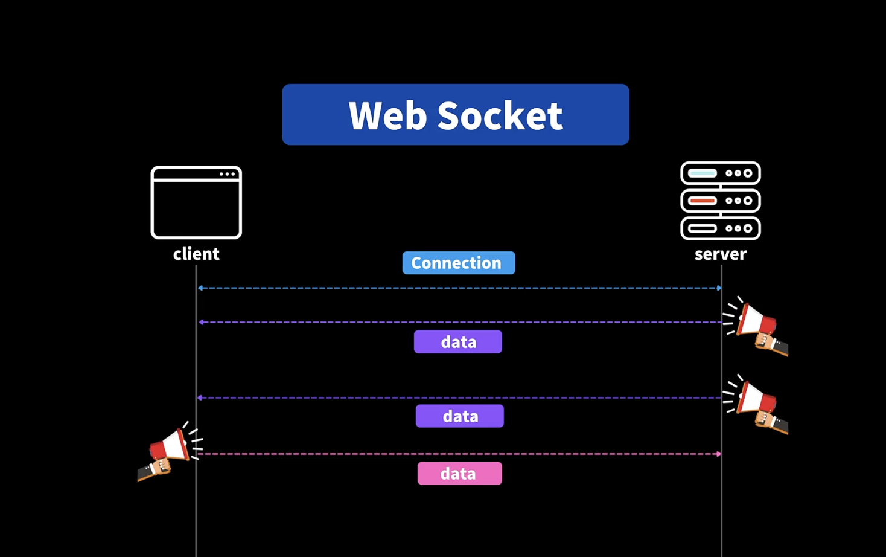

## 18.1 소켓이란?

- 클라이언트와 서버간의 연결이 생기면, 공지사항 같은게 생기면 서버에서 클라이언트에게 데이터를 필요할 때 마다 보낼 수 있다

- 클라이언트도 데이터를 주고 받을 수 있다

- HTTP와 달리 따로 요쳥하는게 아니라 원할 때 마다 주고 받을 수 있는 것



## 18.2 소켓의 기본 사용법 실습

- 서버는 socket.io, 클라이언트는 socket.io-client 라이브러리 설치

- 서버에서 const socketIO = new Server(..) 변수 정의할때

- 저는 자동으로 import가 되었는데, 혹시 자동 import 쓰지 않으신다면

- app.js 파일 위에서 이렇게 import 해오세요 :)

```js
import { Server } from "socket.io";
```

## 18.5 실시간 트윗 받아오기 - 프론트엔드 💡

### Q.

- 다름이 아니라, client/network/socket.js의 Socket 클래스에서

- this.io에 socket을 생성해서 할당할 때, 두번째 인자로 왜

- `{ auth: { token: getAccessToken() }`으로 바로 할당하지 않고,

- `{ auth: { (cb) => cb({ token: getAccessToken() }`으로 콜백으로 한 번 감싸는지 도저히 모르겠어서 질문드립니다. ㅠㅠ

- cb는 어디서 어떻게 인자로 받아서 실행되는 구문일까요..?

### A.

- socket위에 마우스를 올리시거나, 정의된 부분으로 가보시면, url 다음에 opts 인자를 받죠?

- SocketOptions 정의 부분에 보시면 auth라는 키는 오브젝트 또는 함수형태의 값을 가질 수 있다고 정의되어져 있어요.

- 우리는 함수를 정의하므로, 즉 auth라는 키는 함수를 가리키고 있는데, 그 함수는cb라는 콜백함수를 인자로 받아서 void, 아무것도 리턴하지 않는 함수예요.

- 그래서 함수 정의만 보시면, 아! 이 auth라는 키의 함수는 우리가 하고 싶은 특정한 일을 하게만 할수는 없고, 그 함수 안에서는 인자로 전달된 cb라는 함수를 꼭 호출해야 하고, 그 cb를 호출할때 토큰을 전달해 줘야 하는군! 예측해볼 수 있죠

- `{ auth: { token: getAccessToken() }`

- 이렇게 하게 되면 사용할때 auth.token() 이렇게 호출해야 하는데, 위의 제가 캡쳐해드린 코드를 보시면, socket에 전달할 수 있는 인자의 타입 정의와는 맞지 않는걸 볼 수 있어요
