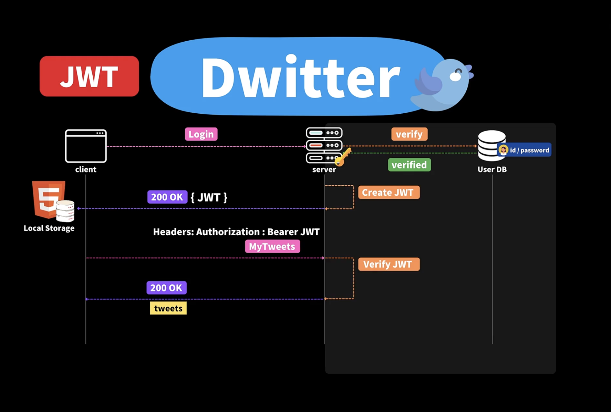
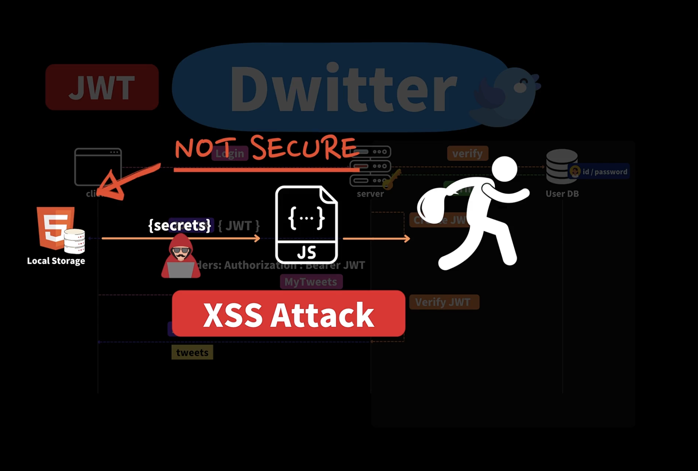

## 26.2 로그인 보안과 유용한 사이트 🔖

- 기존에 JWT 토큰을 민감한 정보를 로컬 스토리지에 저장하는 방식을 사용했었는데, 이 방식은 보안에 치명적인 문제가 있다.

- 해커가 XSS 공격을 통해서 로컬 스토리지에 저장된 JWT 토큰을 탈취할 수 있다.

- OWASP

  - https://owasp.org

- OWASP Node.js Goat

  - https://nodegoat.herokuapp.com/tutorial

  - 위 링크는 더이상 열리지 않아요. 대신 아래 링크를 참고해 보세요:

    - https://ckarande.gitbooks.io/owasp-nodegoat-tutorial/content/index.html
