## 26.2 로그인 보안과 유용한 사이트 🔖

- 기존에 JWT 토큰을 민감한 정보를 로컬 스토리지에 저장하는 방식을 사용했었는데, 이 방식은 보안에 치명적인 문제가 있다.

- 해커가 XSS 공격을 통해서 로컬 스토리지에 저장된 JWT 토큰을 탈취할 수 있다.

- OWASP

  - https://owasp.org

- OWASP Node.js Goat

  - https://nodegoat.herokuapp.com/tutorial

  - 위 링크는 더이상 열리지 않아요. 대신 아래 링크를 참고해 보세요:

    - https://ckarande.gitbooks.io/owasp-nodegoat-tutorial/content/index.html

## 26.3 XSS 어택이란? 대응 솔루션 🚔

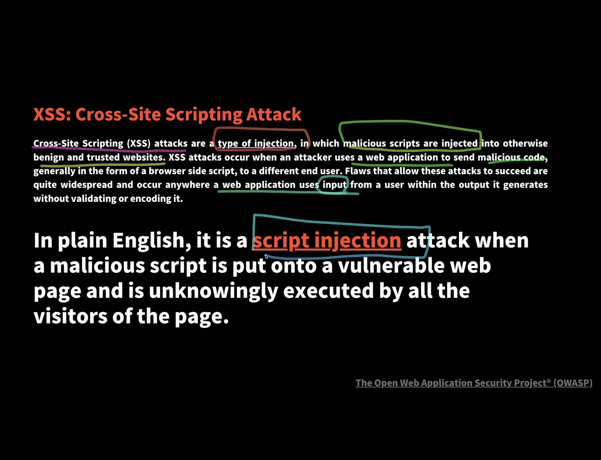

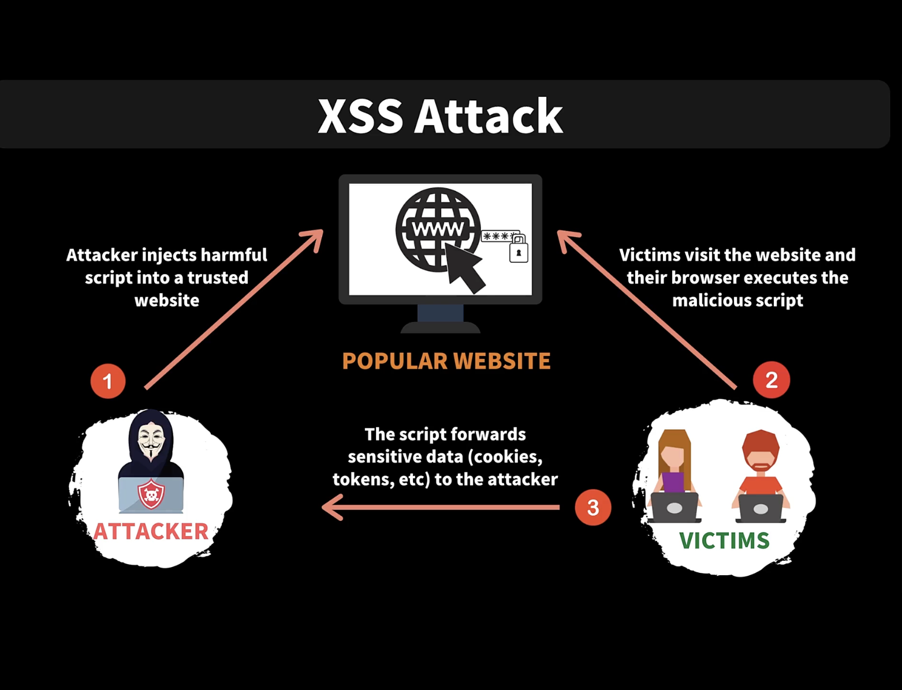

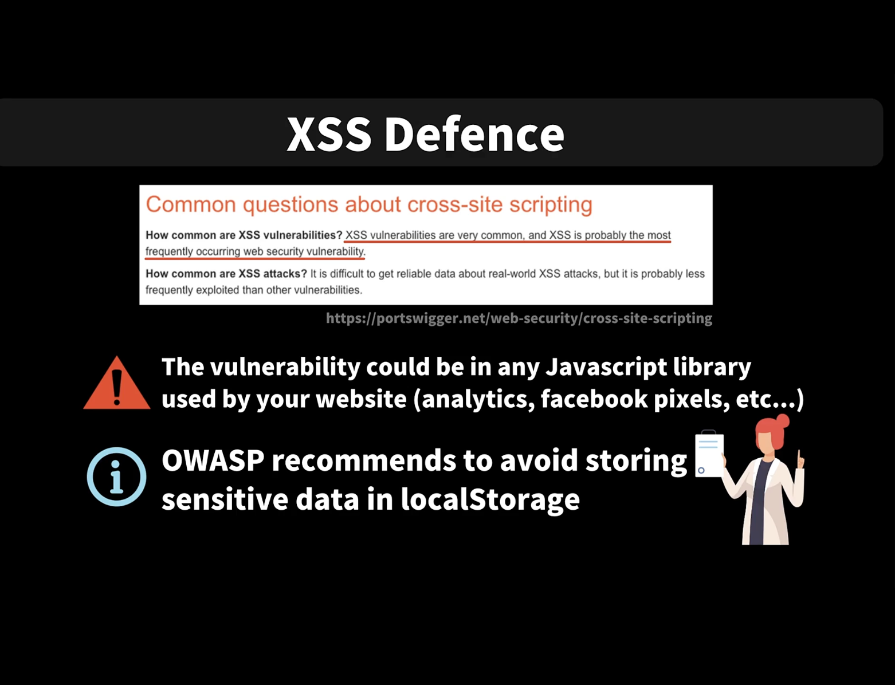

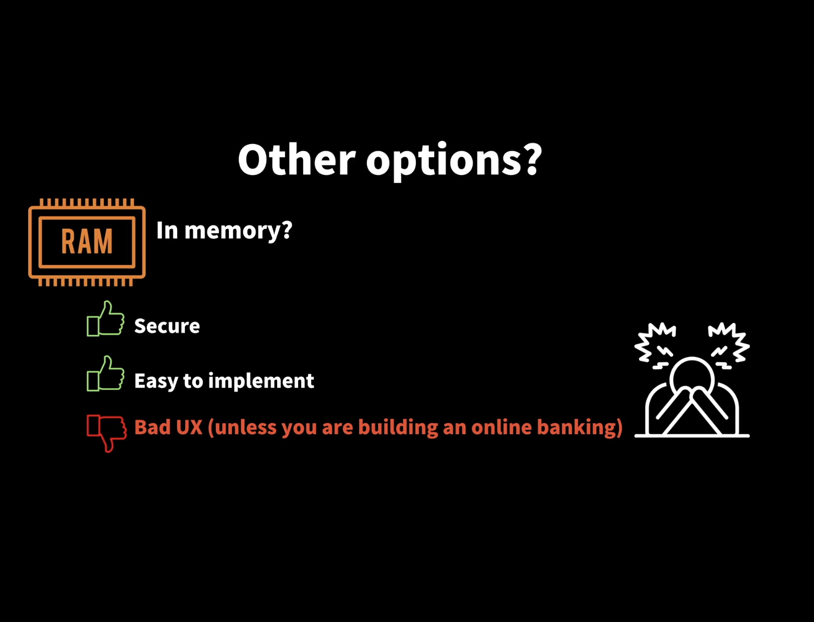

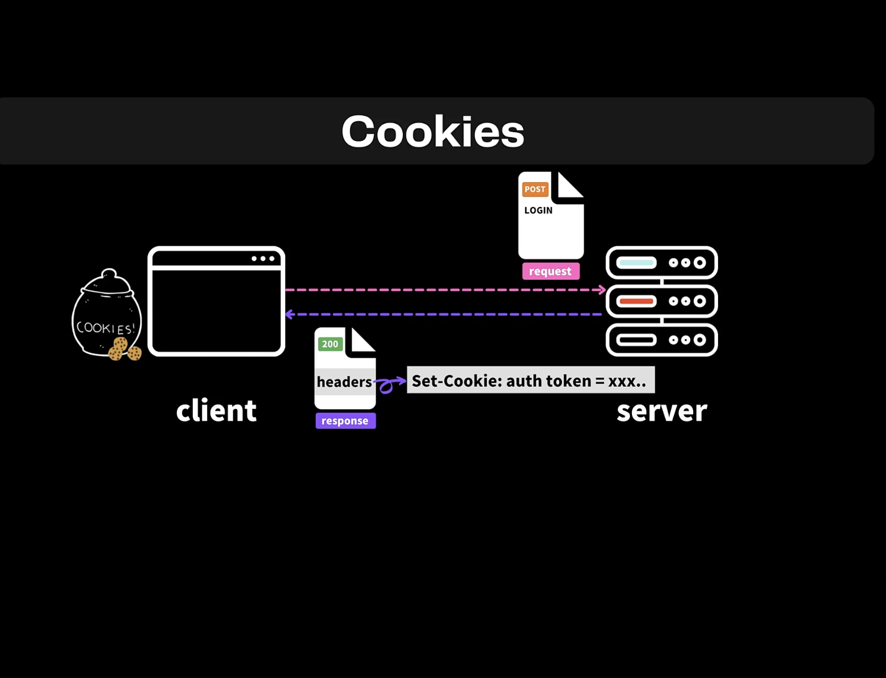

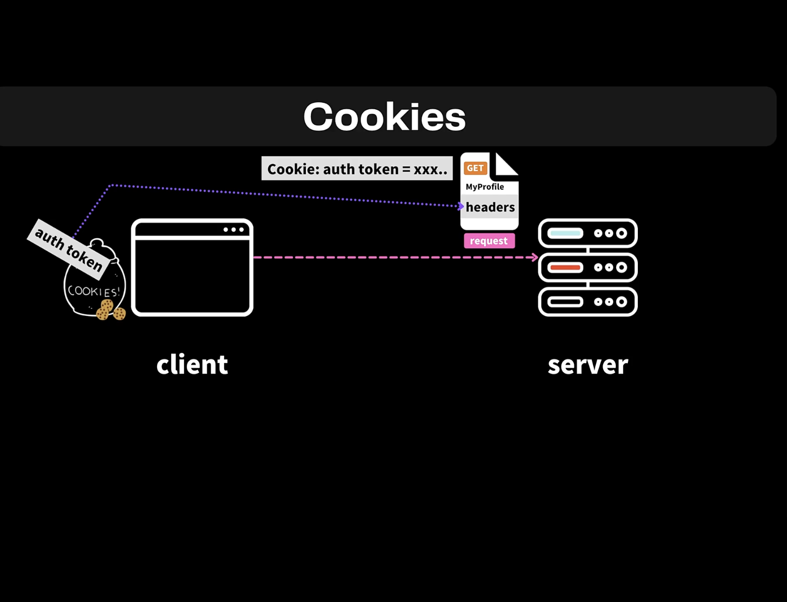

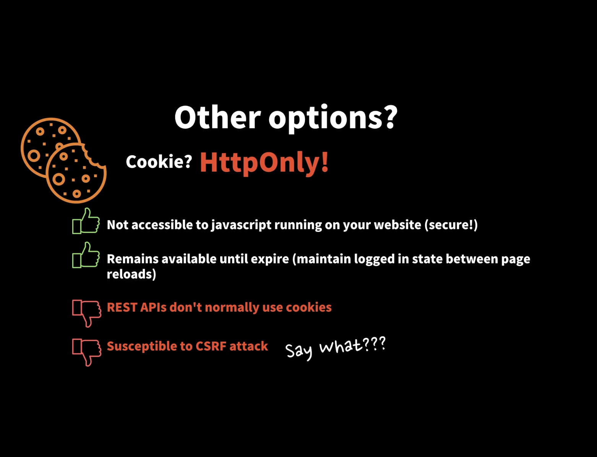

- https://nodegoat.herokuapp.com/tutorial/a3

- https://www.google.com/about/appsecurity/learning/xss/

## 26.4 XSS 어택에 안전한 백엔드 업데이트 💡

- Access-Control-Allow-Credentials 헤더 자세한 설명:

  - https://developer.mozilla.org/ko/docs/Web/HTTP/Headers/Access-Control-Allow-Credentials

### Q.

- body에 token을 남겨 놓은 이유가 non-brower 클라이언트가 헤더의 쿠키를 사용할 수 없어서라고 하셨는데, 그럼 브라우저에서는 토큰을 바디와 쿠키로 받고, 모바일의 경우는 바디로만 받는다는 이야기죠?

- 그런데 다음 강의에서 프론트엔드 설명하실 때, 클라이언트가 어떤 것인지 상관없이 바디에서 오는 토큰은 무시하고 쿠키만 받고 넘겨주도록 설정했는데, 이러면 설명해주신대로 non-browser 클라이언트의 경우 정상 작동할 수 없지 않나요?

### A.

1. 쿠키는 헤더안에 들어있는 필드중에 하나다. 그리고 쿠키는 주로 서버에서 브라우저에게 특정한 정보를 보내고, 브라우저가 그 정보를 통해 자동으로 무언가를 처리 해주기 위해서 사용된다. 브라우저는 쿠키안에 설정된 내용들을 (캐쉬 저장 등) 자동으로 처리 할 수 있는 능력을 가지고 있다.

2. 모바일 클라이언트와 다른 서비스 클라이언트에서도 서버로 부터 받은 바디와 헤더 정보를 볼 수 있고, 처리 할 수 있다. 하지만 통상적으로 헤더 안의 쿠키는 브라우저 용으로 간주하므로, 필요한 데이터는 헤더 또는 바디에서 받지, 쿠키에 필요한 데이터가 있을거라고 예상하지 않는다.

3. 그래서 서버는 토큰을 헤더 쿠키에 (\*이때 쿠키를 사용하는 이유는 HTTP-ONLY 옵션을 사용해서 브라우저에서 다른곳에 저장하지 못하게 하고, 서버에게 요청시 자동으로 토큰을 헤더 쿠키에 추가하게 해주기 위해서) 넣어서 보내고, 브라우저 외의 다른 클라이언트를 위해서 바디안에 토큰을 넣어서 보낸다.

4. 서버로 부터 받은 토큰을 브라우저는 쿠키에 있는 토큰을 자동으로 기억했다가 다음 요청시 토큰을 추가해서 보내주므로, 웹 클라이언트 (우리의 프론트엔드 코드)에서 별도로 처리 해줘야 하는 코드는 없다

5. 서버로 부터 받은 토큰을 브라우저외의 클라이언트들은 바디안의 토큰을 기억했다가 (이때 각각 클라이언트들이 어디에다가 저장해 두는지는 그들의 구현사항) 서버에게 요청을 보낼때 Authorization 헤더에 추가해서 보내줘야 한다.

### Q.

- 웹에서 사용하거나 웹뷰등을 이용한 모바일 환경에서 사용할때에는 현재 구현의 코드로 사용이 가능하나 만약 모바일 앱에서 해당서버를 사용해야한다면 모바일 경우 모바일에서 사용할 해당 스토리지에 저장하도록 클라이언트쪽만 수정해주면 되나요?

### A.

- 네! 그렇죠 👍

- 모바일 클라이언트에서 직접 토큰을 안전하게 보관할 수 있도록 구현해 주면 되요.

- 모바일 앱에서는 브라우저와 다르게 앱만의 안전한 저장공간을 프레임워크에서 제공해 주기 때문에 비교적 안전하게 관리 할 수 있어요 🤓

## 26.7 CSRF 어택이란? 대응 솔루션 🚔

- https://nodegoat.herokuapp.com/tutorial/a8

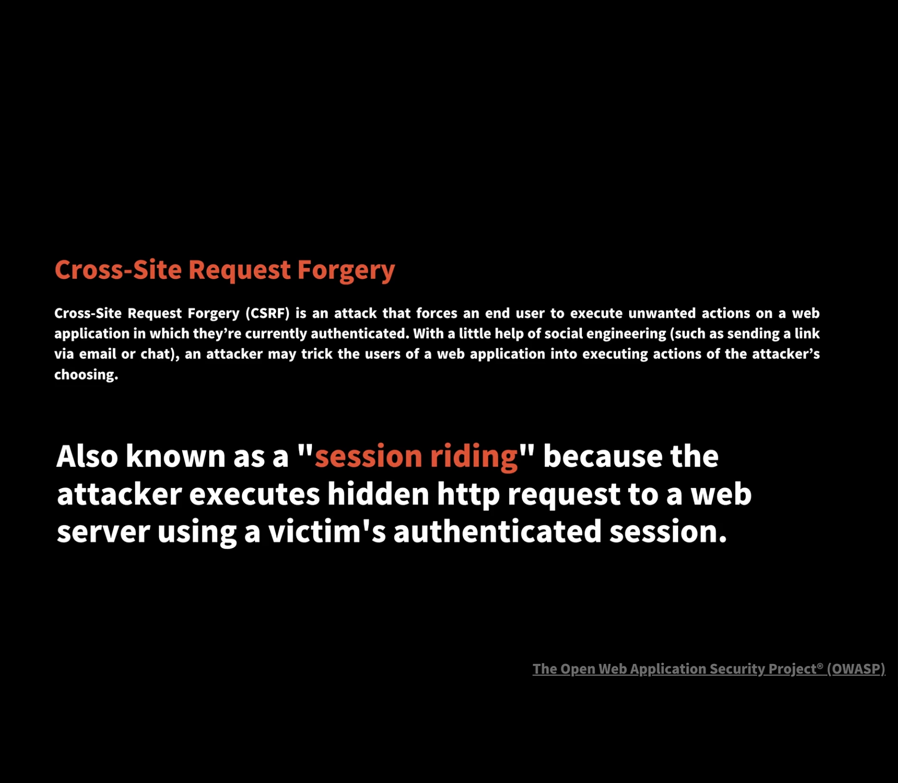

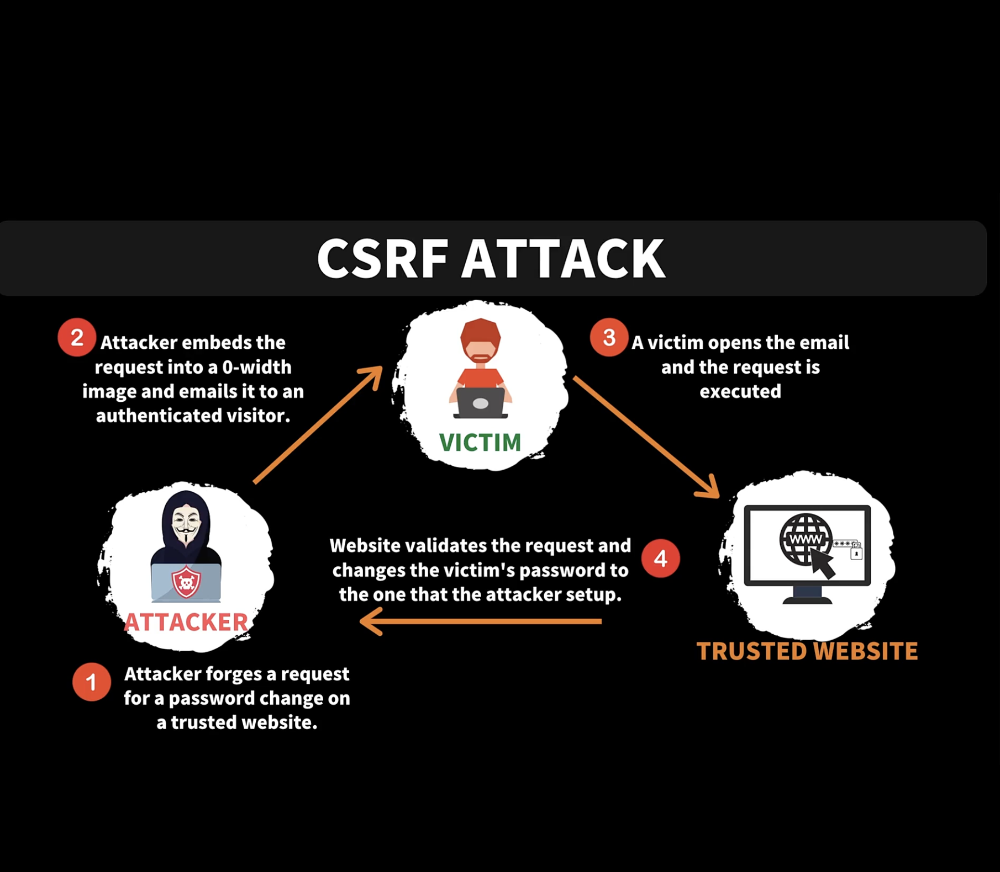

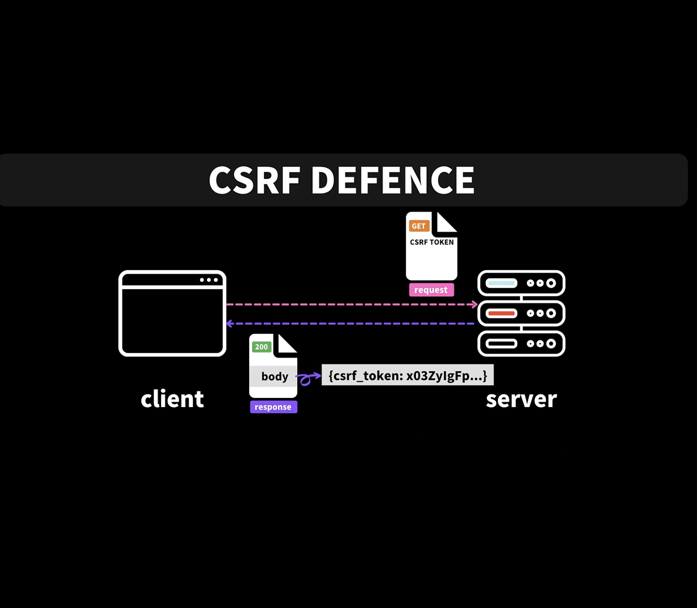

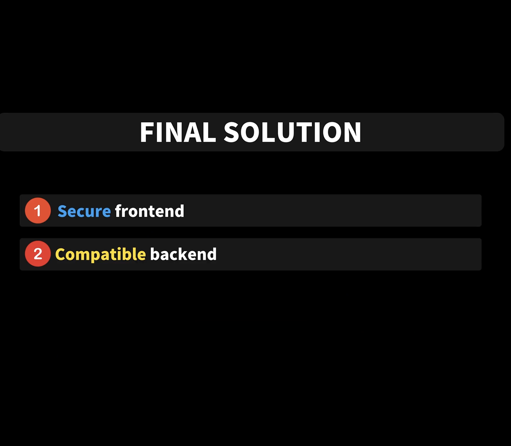

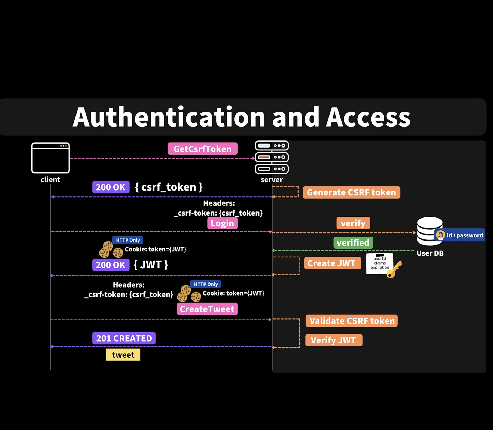

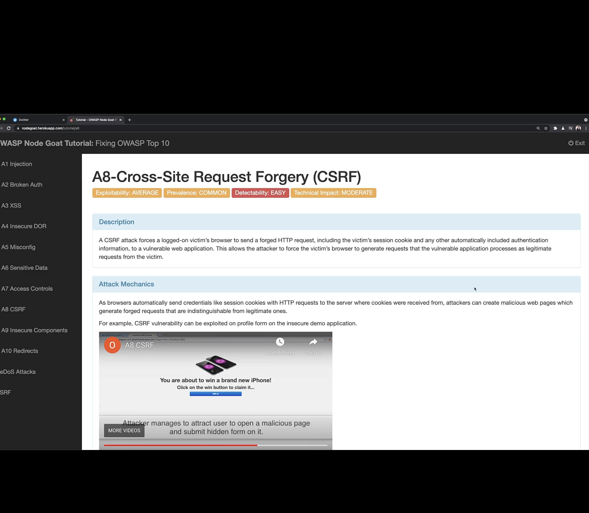

### Q.

- crsf-token 을 통해 이 공격을 막지 않아도 서버에서 access-control-allow-origin 을 한정해두면

- 아까 말씀하신 hacker가 보낸 파일로부터 명령이

- preflight cheking 에서 origin이 달라 막히므로 본 요청은 서버로 안오지 않나요?

- 아니면 서버에서 set cookie 설정을 할때 same site 설정을 lax나 strict로 설정해서 보내면 다른 origin으로부터 온 javascript 파일이 우리 서버로 요청을 보낼때 쿠키가 빠져서 오니 괜찮지 않나요?

### A.

- 좋은 질문이예요 👍

- 결론부터 말씀 드리자면 CORS나 SameSite 속성 둘다 CSRF로 부터 보호할 수 있는 좋은 수단이라고 볼 수 없어요.

- **① CORS**

- 아시겠지만, CORS의 Same Origin 정책은 서버로 오는 모든 요청에 대해서가 아니라, 프리플라잇(preflighted) 요청에 한해서만 적용이 되어요.

- (참고: https://developer.mozilla.org/ko/docs/Web/HTTP/CORS)

- 예를들어, 숨겨진 폼(form)에서 발생하는 POST 요청은 "simple" 요청으로 간주 되기 때문에 preflight을 생성하지 않아요. 그래서 CORS 정책으로 보호 받을 수 없죠.

- 무엇보다 CORS에만 의존한다는것은 브라우저에서 제공해주는 기본적인 보안에만 전적으로 의존하는것과 동일해요.

- 각각의 브라우저마다 버그와 🐛 예상하지 못한 보안 문제가 있을 수 있어요. 예전에 특정한 요청에 대해 "origin"이 헤더에서 누락되어 서버로 보내지는 심각한 보안 버그가 있었어요 ( https://bugzilla.mozilla.org/show_bug.cgi?id=446344)

- 그리고 아직 밝혀 지지 않은 보안에 관련된 취약성이 아직도 있을 수도 있죠 :)

- 사용자가 어떤 브라우저를 사용하고 있는지 모르기 때문에, 브라우저에만 의존하는 CORS만 가지고 CSRF 보호를 잘 할 수 없어요.

- **② SameSite**

- SameSite도 마찬가지로, 모든 브라우저에서 다 지원되는게 아니예요.

- https://caniuse.com/?search=samesite

- 그래서 이 속성 만으로 CSRF을 방어하겠다 라고 생각하기에는.. 조금 무리가 있어 보이죠? :)

- 그리고 우리의 경우처럼 프론트엔드와 백엔드를 다른곳에 배포 하는 경우에는 SameSite를 사용할 수 없어요 (none으로 지정해야 함)

- 결론: 브라우저에 의존하지 않는, 특정한 브라우저 버전에 의존하지 않는,조금더 강력한 보안 시스템이 필요하고 CSRF Token이 가장 보편적으로 많이 쓰이고, 심플하지만 꽤 효과적인! 또 추천되어지는 방식이예요 :)
